```{r setup, include=FALSE}
knitr::opts_chunk$set(echo = TRUE)
```

```{r, echo=FALSE}
library(kableExtra)
```

<div style="text-align: justify">

<center> <h2> Introducción </h2> </center>


El auge que ha tomado el sector de belleza masculino en especial los negocios dedicados al corte de pelo y barba exclusivos para los hombres a través de los últimos años ha tenido un impacto impresionante en la ciudad de Medellín el cual ha creado de alguna manera u otra cambios culturales que la sociedad ha percibido, pero más allá de esto, ha generado un impacto económico, el cual se desconoce y en este momento nace la inspiración de intentar estudiarlo, porque este sector tiene una influencia sobre los rincones más ricos y más pobres de la cuidad, por tanto es necesario ir más allá e intentar descubrir qué porcentaje de la economía de Medellín puede estar protagonizada por este sector y lo que pasa es que este tipo de estudios es muy difícil manejarlos mediante la estadística clásica, ya que para hacer estimaciones adecuadas de este campo tan amplio se deben tomar tamaños de muestra muy grandes lo cual es algo muy costoso y requiere mucho por ello nos apoyamos de otras herramientas como la estadística Bayesiana con la que podemos tener soluciones más factibles que nos pueden llevar a buenos resultados y son técnicas más viables las cuales valoran el conocimiento que expertos en el área tienen frente a este problema que se quiere estudiar.


## Marco teórico

Una de las principales limitaciones de la estadística clásica o frecuentista es que no permite incorporar de manera coherente en el análisis estadístico la información extra-muestral o información previa que provenga de expertos en el área disponible, ya que se apoya únicamente en datos muestrales observados y en muchas casos esta información adicional puede ser de mucha utilidad, ya que viene directamente de personas que tienen una experiencia y experticie en el tema la cual puede tener una perspectiva más acertada del fenómeno que se está estudiando.


En la práctica, a menudo la incertidumbre o el desconocimiento sobre el tema de interés hace que la toma de decisiones sea en la mayoría de los casos muy compleja, por lo cual es común que las decisiones se apoyen en expertos que proporcionan información en forma de estimaciones de probabilidad con respecto a dichas incertidumbres. Las distribuciones de probabilidad son una de las representaciones más usadas de la incertidumbre que se tiene acerca de un tema de interés. Dichas distribuciones no son más que expresiones formales de lo que piensa o sabe un experto, por lo tanto, no es adecuado juzgarles como buenas o malas. La transformación mental de conocimiento subjetivo en una distribución de probabilidad es una tarea difícil (van Lenthe, 1993) y se deben tener en cuenta algunas técnicas para la captura de la información teniendo siempre en mente que es un proceso extremadamente delicado; En este caso puntual vamos a hacer uso de las técnicas popularmente utilizadas en la estadística Bayesiana llamadas elicitaciones(distribuciones no informativas); La literatura sobre elicitación de expertos sugiere diversos pasos críticos para llevar a cabo un buen proceso de elicitación (Jenkinson, 2005).

El proceso de elicitación debe enfrentar un protocolo cuidadoso y profesional que le permita al analista documentar el proceso. En general, dicho protocolo no difiere mucho de los principios estándares de recolección de datos, donde se espera que el analista asegure la validez científica de sus datos. 

En este estudio particular se hará uso de dos tipos de elicitaciones la cuales tienen el nombre de: Elicitación gráfica a mano alzada y elicitación vía muestras hipotéticas.

Las elicitaciones como tal nos permiten hallar una distribución apriori para un parámetro el cual se está estudiando, de tal manera que mediante una distribución se pueda representar el conocimiento que tiene el experto bajo el problema de estudio.


## Características del estudio

* El estudio está basado en el impacto de los peluqueros, barberos y estilistas que realizan procedimientos con el cabello del género masculino.

* Solo se está centrado en los procedimientos sobre el género masculino ya que para el género femenino la variedad de procedimientos es muy amplio y complejo de estudiar.

* La idea es intentar estudiar el ingreso total de todo el sector mensualmente.

* Este estudio solo está basado en la ciudad de Medellín.

* La idea es intentar hacer una estimación puntual, distribucional y realizar inferencias sobre el ingreso total mensual del sector a partir solamente del conocimiento que tengan tres expertos en el área.


## Antecedentes y Preparación 

Bajo este estudio se quiere llegar a la estimación distribucional de tres parámetros que salen a partir de la solución a las siguientes tres preguntas:

1) El número de peluqueros (se incluyen peluqueros, estilistas, y barberos) que hay en la ciudad de Medellín (Elicitación distribución discreta).

2) El número promedio de servicios a clientes (pueden ser los mismos clientes varias veces) que atiende cada peluquero en un mes. (elicitación distribución discreta).

3) ingreso promedio por servicio. (Elicitación distribución continua).


Las tres distribuciones elicitadas previamente serán las que ayudaran a la estimación distribucional a la pregunta que es realmente el interés bajo este estudio 

<center> <h4> "El ingreso total del sector por mes" </center> </h4>

<br>
<br>

### Tipos de elicitaciones a utilizar

**Elicitación gráfica a mano alzada** Está basada en una gráfica que contiene expresiones verbales que miden el grado de seguridad que el experto tiene sobre un determinado valor, es decir, en el "eje x" se le plantean valores posibles que puede tomar el parámetro a estudiar y en el "eje y" se presentan expresiones verbales las cuales entre más alto generan mayor nivel de seguridad de tal manera que el experto para cada valor en el "eje x" le debe asignar una expresión verbal del "eje y" y mediante esto construir una distribución del respectivo parámetro bajo estudio.

<br>

#### La distribución del número de peluqueros en la ciudad de Medellín fue elicitada mediante elicitación gráfica a mano alzada:


Los valores para el "eje x" es decir los valores que representan el número de peluqueros en la ciudad de Medellín toman valores de 1 a 100 mil (avanzando de a 2500 de manera equiespaciada) los cuales fueron considerados después de realizar una investigación y de analizar que fuera un rango de valores los cuales consideraran los valores que los expertos pensaban, de tal manera que la plantilla se estructuro de una manera inicial y posteriormente, de tener un dialogo con los expertos se mejoró para brindar a estos un rango amplio de valores y en el cual estuviera presente el que ellos consideraban como más probable.

Las expresiones del "Eje y" fueron consideradas por los analistas que están trabajando este estudio como las expresiones más adecuadas y fueron acomodadas a una altura que de verdad trasmitiera el nivel de seguridad correspondiente, este proceso fue realizado varias veces de tal manera que al final quedo de la manera más acertada para que cualquier persona lo asimilara correctamente.

```{r, echo=F}
kable(data.frame(Altura = c(0,5,15,20,35,50,60,75,90,95,100), Expresión = c("Totalmente imposible", "Me parece muy improbable", "Me parece un poco improbable", "No me genera seguridad", "Es más bien algo incierto", "Ni acuerdo ni en contra(50-50)", "Pudiera ser, pero...", "Me parece algo posible", "Me parece demasiado viable", "Estoy casi seguro", "Absolutamente seguro")))%>%
  kable_paper(full_width = F)
```


**Plantilla de elicitación para el número de peluqueros/barberos/estilistas en la ciudad de Medellín**

<center>
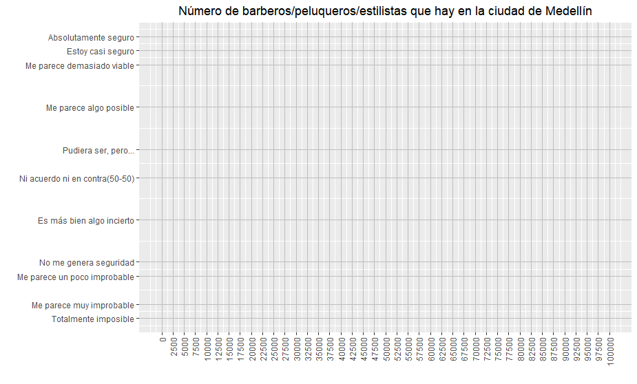
</center>

<hr>
<br>


#### La distribución del número promedio de servicios a clientes (pueden ser los mismos clientes varias veces) que atiende cada peluquero en un mes fue elicitada mediante elicitación gráfica a mano alzada:

Los valores para el "eje x" es decir los valores que representan el número de servicios en un mes toma valores de 0 a 1000 (avanzando de a 25 de manera equiespaciada) los cuales fueron considerados después de realizar una investigación y de analizar por lo tanto se considero 0 que es un valor donde no atienden a clientes y 1000 es un caso en donde el especialista trabaja más de 15 horas diarias, atiende en muy poco tiempo a cada uno de sus clientes y además son turnos seguidos, es decir sin tiempo de descanso, por lo que se espera que este valor sea tan alta que sea poco probable y con este se da via a que el valor promedio de clientes este entre el rango de valores disponibles y estuvieran en los valores que los expertos pensaban y efectivamente fue un rango adecuado.

Las expresiones del "Eje y" fueron consideradas por los analistas que están trabajando este estudio como las expresiones más adecuadas y fueron acomodadas a una altura que de verdad trasmitiera el nivel de seguridad correspondiente, este proceso fue realizado varias veces de tal manera que al final quedo de la manera más acertada para que cualquier persona lo asimilara correctamente.

```{r, echo=F}
kable(data.frame(Altura = c(0,5,15,20,35,50,60,75,90,95,100), Expresión = c("Totalmente imposible", "Me parece muy improbable", "Me parece un poco improbable", "No me genera seguridad", "Es más bien algo incierto", "Ni acuerdo ni en contra(50-50)", "Pudiera ser, pero...", "Me parece algo posible", "Me parece demasiado viable", "Estoy casi seguro", "Absolutamente seguro")))%>%
  kable_paper(full_width = F)
```


**Elicitación del número promedio de servicios en un mes de un peluquero/barbero/estilista de la ciudad de Medellín**

<center>
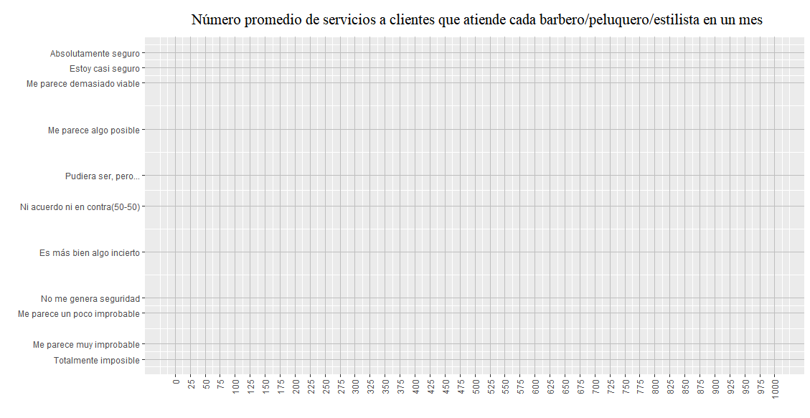
</center>

<hr>
<br>

**Elicitación via muestras hipoteticas** Esta basada en la imaginación de una muestra de tamaño n, en la cual mediante casillas que presentan los valores posibles que puede tomar el parametro de interes, se deben acomodar en cada uno de estos una porción de la muestra de tal manera que al sumar la cantidad presente en cada casilla debe dar un total de n, es decir, se debe repartir la muestra entre todos los valores que puede tomar la variable a estudiar, de tal manera que en valores más posible debe quedar una porción de la muestra más grande.

<br>

#### La distribución del ingreso promedio por servicio se realizó mediante la elicitación vía muestras hipotéticas:

Se consideró realizar este tipo de elicitación dado que para una persona natural es más difícil pensar en términos del pago promedio por servicio y mediante este tipo de elicitación va a pensar en algo que es más intuitivo que es en número de especialistas de 1000 disponibles que cobrarían por sus servicios cada uno de los precios que se le está proporcionando.

Dado que en este caso se manejan pesos colombianos, se crearon 20 casillas que tienen valores de 0 pesos a 50 mil pesos, las casillas tienen intervalos de a 2500, es decir, la primera casilla tiene de "0-2500", la segunda de "2501-5000", la tercera "5001-7500" y así sucesivamente siendo la última casilla "50001-más" de tal manera que al experto se le pide que se imagine una muestra de 1000 especialistas en el cabello de hombres(peluqueros/barberos/estilistas) y que acomode en cada uno de estos precios cuantos de los 1000 cobrarían entre esos intervalos, de tal manera que cuando acomode todos, el total le sume los 1000.


La plantilla se presenta a continuación:


<center>

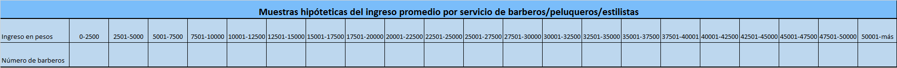
</center>


## Identificación y Contratación de Expertos

**Expertos elegidos**

Para realizar estos procesos de elicitación se requieren expertos reales es decir barberos, peluqueros o estilistas, debido a que este proceso no se le debe hacer por ejemplo a un cliente ya que este puede tener un punto de vista sobre el tema sesgado a su comportamiento particular sobre este entorno y no va a tener la dimensión sobre todo el campo como lo podria tener un especialista en el tema.

Para realizar las tres elicitaciones descritas anteriormente se buscan a tres expertos:


Experto 1.

**Carlos Mario Bedoya**

Barbero/peluquero del barrio Castilla de 32 años de edad, es un experto que lleva aproximadamente 1 año y medio en el campo, tiene su propio local muy bien acreditado y trabaja al lado de otros 3 barberos más, realmente siente gusto por lo que hace y es algo que visualiza para su vida muchos años más.


Experto 2

**Marlon Hernandez**

Barbero/peluquero del barrio Castilla de 24 años de edad, es un experto que lleva aproximadamente 7 años en el campo, ha trabajado en 3 locales, los cuales han estado ubicado en el barrio Castilla y en el barrio Boyaca las brisas y actualmente se encuentra ejerciendolo desde su propia casa, siente mucho gusto por el área, siente que es en algo que desempeña muy bien y dia a dia aprende cosas nuevas.


Experto 3

**Mateo Rodriguez**

Barbero/peluquero del barrio 12 de octubre de 22 años de edad, es un experto que lleva aproximadamente 4 años en el campo, inicio su aprendizaje de barberia al lado de su hermano el cual tenia un local en Itagüi y actualmente tiene su propio local en el barrio 12 de octubre con el que lleva 3 años.


## Diseño y validación de preguntas

Las preguntas que se le plantearon a cada uno de los expertos fueron las siguientes:

1. ¿Cuántos barberos/peluqueros/estilistas que atienden hombres cree que hay en la ciudad de Medellín?

2. ¿Cúantos clientes atiende en un mes en promedio un barbero/peluquero/estilista de la ciudad de Medellín, es decir, cuantos servicios tiene al mes?

3. ¿Cúanto cree usted que en promedio cobran los barberos/peluqueros/estilistas por ofrecer un servicio (procedimiento sobre el cabello masculino)?


## Recomendaciones que se tuvieron en cuenta a la hora de elicitar

* La opinión de los expertos es la más valiosa para elicitar. 

* A los expertos se les debe pedir que expresen su opinión sobre cantidades obsevables.


* A los expertos no se les debe pedir estimaciones de los momentos de una distribución. 

* Hay que proporcionales retroalimentación frecuentemente durante el proceso de elicitación.

* El objetivo es elicitar una distribución que represente el conocimiento presente del experto, y es útil tener un resumen sobre cuál es la justificación de este conocimiento.

* Cualquier interés personal o fianciero que el experto pueda tener tener en las inferencias o decisiones que dependerían (aún marginalmente) en la distribución del experto, debe ser declarado.


* Debe proporcionarse un entrenamiento para familiarizar al experto con las interpretaciones probabilísticas y tanto con sus conceptos y propiedades que se requieran en la elicitación.

* Es útil correr un ejercicio de elicitación ficticia para proporcionar práctica en el protocolo que el facilicitador se propone utilizar.

* Un registro debe llevarse de la elicitación. Este debe idealmente contener todas las preguntas que fueron realizadas por el facilicitador junto con las respuestas del experto,
también como el proceso con el que se ajustó la distribución de probabilidad con estas respuestas.


### Roles en el proceso de elicitación

- Para realizar este proceso hay que tener en cuenta los dos roles que se presentan que son de facilitador y experto:

**Facilitadores:** En este caso son los analistas que van a  preguntar y guiar en el proceso de elicitación.

**Expertos:** Especialistas en el campo, es decir, barberos, peluqueros y estilistas escogidos para diligenciar las plantillas de elicitaciones.

<br>


### Elicitación ficticia

Teniendo en cuenta los roles descritos anteriormente se procede con una de las recomendaciones:

**Es útil correr un ejercicio de elicitación ficticia para proporcionar práctica en el protocolo que el facilicitador se propone utilizar.**


Mediante esta recomedación los dos facilitadores encargados de la investigación proceden a hacer una elicitación ficticia, en la cual uno de los analistas desempeña el rol de facilitador y el otro el rol de experto y realizan las tres elicitaciones planteadas para este caso de estudio, esta fue registrada mediante un video.

El video lo pueden visitar en el sigiente link...[Elicitación ficticia del sector peluqueros](https://youtu.be/GzqBzVLnim0)


<div>
<p style = 'text-align:center;'>
<iframe width="700" height="394" src="https://www.youtube.com/embed/GzqBzVLnim0" title="YouTube video player" frameborder="0" allow="accelerometer; autoplay; clipboard-write; encrypted-media; gyroscope; picture-in-picture" allowfullscreen></iframe>
</div>
</p>


Mediante esta elicitación ficticia se pretendia preparar a los dos analistas para desempeñar un buen rol de facilitador, prepararse en las preguntas que se le van a proporcionar a los expertos, la información que se le va a otorgar a los mismos y correcciones que se deban hacer en el proceso de elicitación, como mejorar las plantillas de elicitación y demás anormalidades que se perciban en la prueba ficticia.


**Los aspectos a mejorar despues de realizar la elicitación ficticia son:**

- Organizar el rango de valores en la plantilla de elicitación del número de peluqueros en la ciudad de Medellín.
- Mejoramiento de la forma de dirigirse a los expertos, para darse a entender de una manera más acertada ya que tienen muy poco conocimiento estadístico, por lo tanto es necesario el uso de terminologia más generales.
- Brindar la información adecuada para que el experto tenga unas estimaciones acorde a lo que piensa y coherente con la realidad.


<br>

#### Para el proceso de elicitación ficticia y los procesos de elicitación real se pretende otorgarle información a los expertos que le permitan ubicarse mejor en el contexto y responder de una manera más acertada en cada una de las elicitaciones 


**1) Mapa de Medellín: con la finalidad de que el experto dimensione el lugar donde labora en comparación con la dimensión que es toda la ciudad de Medellín**


<center>

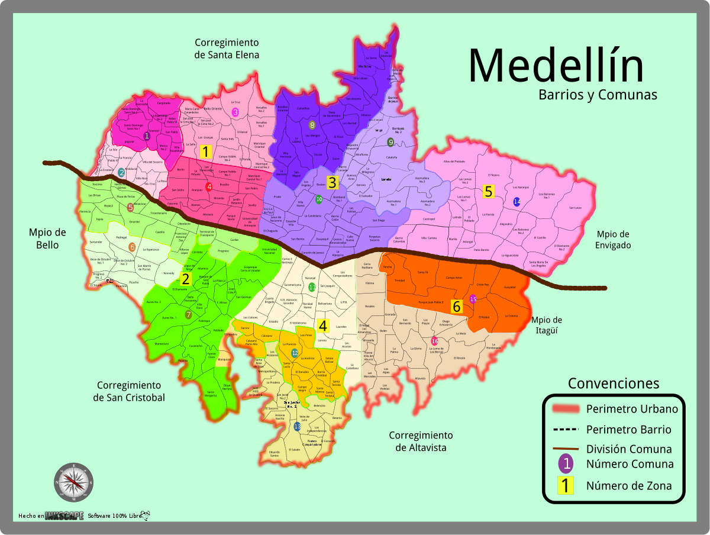{width=60% height=60%}

</center>

El cuál esta compuesto por:

* 6 zonas
* 16 comunas
* 249 barrios
* Tiene aproximadamente 2'500.000 habitantes de los cuales el 47% son hombres

<br>

**2) Se le proporciona la información de los especialistas a tener en cuenta bajo el problema de estudio, los cuales de alguna manera u otra ellos ya tienen conocimiento:**


**Barbero.** Hombre que tiene por oficio afeitar, cortar y arreglar la barba, el bigote y el pelo a los hombres… como se enlistan las prioridades, es el orden de sus aptitudes, no decimos que no sean buenos cortando el pelo, pero simplemente lo suyo es la barba y el bigote, así que si lo que buscas es tener un estilo en tu barba, ya sabes con quien ir.


**Peluquero.** Persona que tiene por oficio peinar, cortar y arreglar el cabello. Este profesional tiene únicamente conocimientos sobre el cabello, por lo que solo deberías de ponerte en sus manos si quieres darle mantenimiento general a tu cabello; ellos no tienen un toque tan fino como los estilistas.

**Estilista.** Persona que tiene por oficio cuidar el estilo y la imagen. Como su nombre lo dice, es una persona que busca darle estilo a las personas, tomando en cuenta el tipo de cara, cuerpo y personalidad. Ellos se fijan mucho en facetas en las que los peluqueros o barberos no son tan meticulosos, por ejemplo, retomando el aspecto de la cara, su alineación y hasta la distribución de cada una de sus partes, lo cual hacen que un look se vea perfecto.


Para más información consultar en el siguiente link... [ESTILISTA, BARBERO O PELUQUERO, DEFINICIONES Y ¿CUÁL ES LA DIFERENCIA?](https://www.soymacho.com/blogs/blog/diferencia-estilista-barbero-peluquero#:~:text=Persona%20que%20tiene%20por%20oficio,tan%20fino%20como%20los%20estilistas)

<br>

## Aplicación del Método de Elicitación

_Momento de elicitar a nuestros expertos_

## Experto 1

Este fue elicitado por:

Facilitador 1: Jennifer Salazar Galvis

A este experto se acudio hasta su local, en el cual se le pidio la colaboración en el proceso de elicitación a cambio de pagarle el tiempo de un corte de cabello el cual corresponde a 12.000 pesos colombianos, muy amablemente, el experto ofrecio gran parte de su tiempo para realizar bien este proceso.

A el experto se le explico como debia realizar cada uno de los procesos de elicitación, se le dieron las pautas y toda la información necesaria para ayudar a guiarlo en su proceso de estimación, el facilitador lo estuvo acompañando aproximadamente 3 horas en las que el experto estuvo analizando con mucha calma todo, luego de eso, se comenzo a la realización del proceso de elicitación el cual fue grabado para que los facilitadores despúes pudieran hacer uso de este recurso y utilizarlo en su analisis


El link del video se presenta a continuación....[Proceso de Elicitación Experto 1](https://youtu.be/szkTps58MDM)


<div>
<p style = 'text-align:center;'>
<iframe width="700" height="394" src="https://www.youtube.com/embed/szkTps58MDM" title="YouTube video player" frameborder="0" allow="accelerometer; autoplay; clipboard-write; encrypted-media; gyroscope; picture-in-picture" allowfullscreen></iframe>
</div>
</p>


### Las plantillas de elicitación realizadas por este experto se presentan a continuación:

**Elicitación 1**

<center>
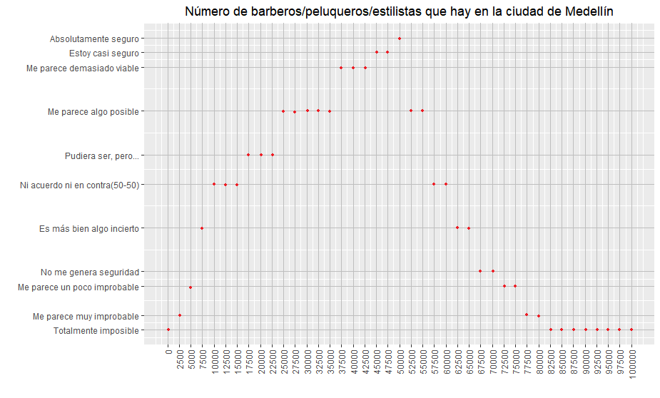
</center>

**Resumen de la elicitación**

A la hora del experto estar realizando esta elicitación, comenzo a pensar muy concentradamente en esta pregunta, incluso la plantea a otros de sus compañeros de trabajo, él consideraba que el número de especialistas en cabello masculino realmente era grande, y en especial ya que en el sector que se encuentra laborando se rodea de muchos locales que cumplen esta condición, porque el afirmaba que en su propio barrio habia una cantidad muy grande, entonces era impresionante todo lo que podia haber en Medellín, además que él ha tenido la oportunidad de conocer mucho a Medellín en anteriores trabajos y dice que en la mayoria de calles de Medellín hay locales de estos, por lo tanto él dice que realmente la cantidad peluqueros es mucho y que adicionalmente el considera que la mayoria de locales no estan registrados por el DANE por lo que considera que pueden ser muchos más de lo que la información presente en internet brinda.


<br>

**Elicitación 2**

<center>
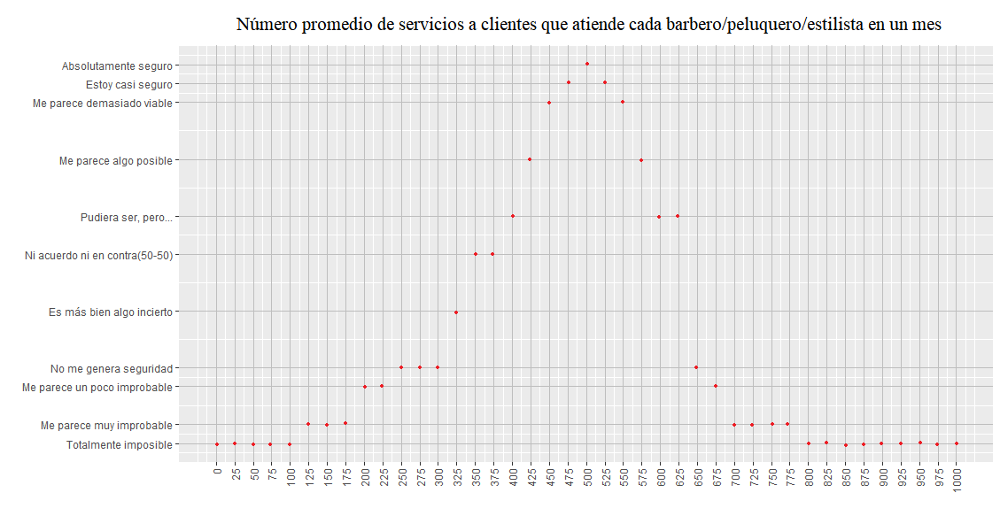
</center>

**Resumen de la elicitación**

Para responder esta pregunta el experto entro a analizar cuantos cliente atendia en semana, considerando que los dias de lunes a miercoles de por si atiende un número menor de clientes que los que atiende jueves, viernes y en especial el fin de semana que es mucho mayor, más o menos analizo como se comporta una semana en promedio y trato de llevar este comportamiento a nivel de un mes y dar una estimación de lo que el considera, además de intentar pensar en otros barberos que ha tenido la oportunidad de conocer y sus flujos de clientes.

<br>


**Elicitación 3**

<center>
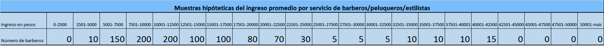
</center>

<br>

**Resumen de la elicitación**

Para esta pregunta el experto consideraba que la mayoria de especialistas en cabello masculino cobrarian precios alrededor de lo que él cobra, es decir más o menos entre 7500 y 12500 y a medida que se alejaba de estos precios colocaba un tamaño de muestra menor, pero en precios de 25000 y 32500 coloco una proporción menor  que en los precios de 32500 a 42500 dado que consideraba que los unicos que podian cobrar estos precios tan altos eran especilistas de centros comerciales o de zonas de estratos más altos y que estos tendrian a cobrar valores muy altos y no intermedios o bajos y este experto considera que encontrar a alguien que cobre menos de 2500 es una muestra de mil es casi imposible al igual que alguien que cobre más de 42500 pesos colombianos.


## Experto 2

Este fue elicitado por:

Facilitador 1: Jennifer Salazar Galvis

A este experto el facilitador previamente tenia conocimieto sobre él y sobre la expeticie que tiene en el tema ya que conoce que lleva más de 7 años en el campo, por lo tanto el facilitador lo contacto por redes sociales y le pidio amablemente la colaboración en el proceso de elicitación al cual el experto accedio sin problema alguno.

El proceso de elicitación se le realizo a este experto via **meet** el cual previamente se le explico al experto todas las pautas que debia tener en cuenta a la hora de realizar cada una de las elicitaciones, se le dio información que lo ayudara a guiarse más en su proceso de estimación y se entablo en aproximadamente una hora una conversación que le permitio al experto realizar estimaciones a las tres preguntas planteadas de acuerdo a sus pensamientos y conocimientos del tema, cuando este ya se sentia preparado, se procedio a empezar los procesos de elicitaciones los cuales fueron grabados y pueden ser visualizados a continuación:


El link para visualizar el video lo pueden encontrar aqui... [Proceso de Elicitación Experto 2](https://youtu.be/dGDup7Vrg9s)

<div>
<p style = 'text-align:center;'>
<iframe width="700" height="394" src="https://www.youtube.com/embed/dGDup7Vrg9s" title="YouTube video player" frameborder="0" allow="accelerometer; autoplay; clipboard-write; encrypted-media; gyroscope; picture-in-picture" allowfullscreen></iframe>
</div>
</p>


### Las plantillas de elicitación realizadas por este experto se presentan a continuación:

**Elicitación 1**

<center>
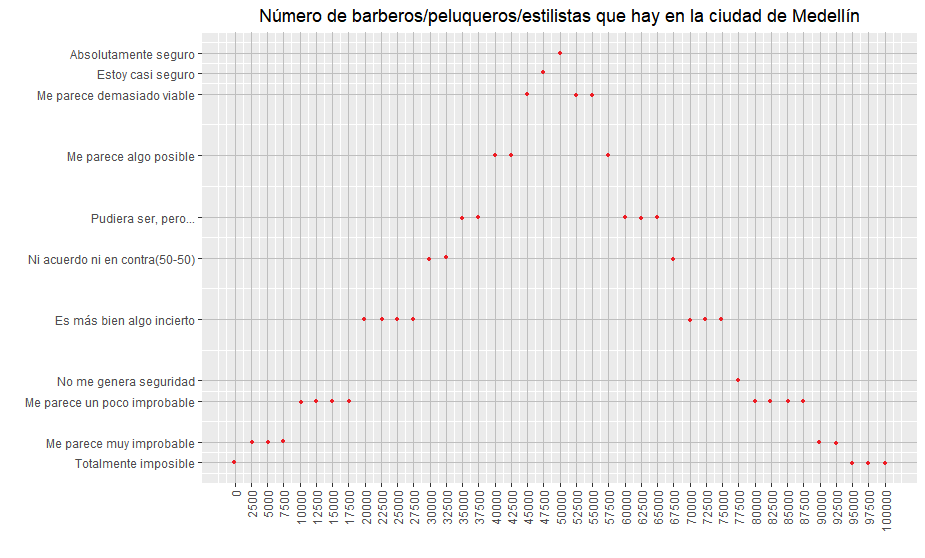
</center>

**Resumen de la elicitación**

A la hora de hacerle esta pregunta del número de peluqueros en la ciudad de Medellín este experto se encontraba muy pensativo dado que nunca habia pensado en esto y consideraba que la cantidad era tan grande que no se lo alcanza a imaginar, empezo a establecer cifras demasiado grandes que parecian un poco exageradas, a medida que continuaba pensando las acomoda un poco mejor las cifras considerando valores muy grandes pero no exagerados, el se sentia muy seguro de lo que decia y no estaba de acuerdo con bajar su estimación y en varios ocasiones afirmo que el gremio de barberos, peluqueros y estilistas habia crecido demasiado en los últimos años, hasta considerar que parecia una moda, dado que cuando empezo en este sector decia que no era tan común ver muchas personas que lo ejercieran pero que al pasar de los años tuvo la oportunidad de ver como muchas personas empezaban a emplearse en este sector y además la cantidad de locales que en los últimos años se montaron, cuestión que lo impresionaba y lo llevaba a pensar en lo popular que se volvio el oficio y que a la vez lo motivo a seguir en el sector.

<br>

**Elicitación 2**

<center>
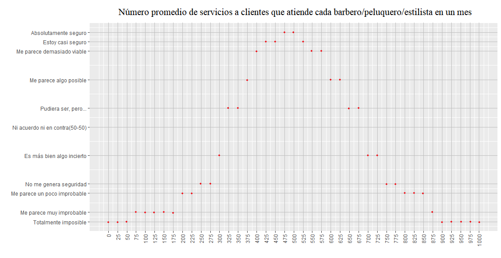
</center>

**Resumen de la elicitación**

Para esta pregunta el experto penso en el número de clientes que atendia en cada uno de los locales en los cual trabajo como barbero y en cuantos clientes atiende ahora que trabaja de manera independiente, además de pensar en aquellos negocios que suelen tener muchos clientes y en los que suelen haber pocos, de tal manera que pudiera dar una buena estimación del promedio de clientes en un mes, además de esto penso en cuanto seria lo minimo que atiende cuando le va muy mal y cuanto es lo máximo que atiende cuando le va muy bien, de tal manera que pueda reducir más el rango de donde estaria el promedio de clientes en un mes a su consideración, también se sentia muy seguro de sus estimaciones ya que lleva muchos años de experiencia en como se comporta este sector.


<br>

**Elicitación 3**

<center>
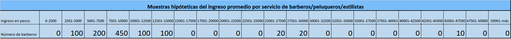
</center>

<br>

**Resumen de la elicitación**

Este experto consideraba que lo más tradicional en la ciudad de Medellín es cobrar entre un poco menos de 5000 y 15000, porque en su perspectiva cobrar más de esto no es adecuado a menos que este en una zona de un estrato muy alto, o en lugares más prestigiosos como centros comerciales y que además ofrezcan servicios adicionales que los barberos de barrios de por si no ofrecen, de tal manera que valga la pena cobrar más de 15 mil, por otro lado el considera que en una muestra de 1000 es muy dificil encontrar a alguien que cobre entre 15000 y 25000 y que por otro lado entre 25000 y 30000 deberian estar aquellos que cumplen las condiciones antes descritas, siendo un caso mucho más particular y costoso los que cobran entre 45000 y 47500.

<br>

## Experto 3

Facilitador 2: Juan Esteban Sanchez Pulgarin 


Dado que el facilitador actualmente se encuentra viviendo en Amaga el cual no pertenece a la ciudad de Medellín y los expertos deben ser de Medellín este facilitador procede a buscar via internet expertos en el area de tal manera que logra tener el telefono de varios y pedir a cada uno de ellos colaboración en el proceso de elicitación hasta que uno de ellos quiera hacerlo, el facilitador logra entablar una conversación con un experto que es barbero/peluquero del barrio 12 de octubre el cual accede a dar su colaboración a cambio del pago de 15.000 pesos colombianos y el facilitador accede y plantean un dia y hora puntual para hacer el proceso de elicitación.

El proceso de elicitación se le realizo a este experto via **meet** el cual previamente se le explico al experto todas las pautas que debia tener en cuenta a la hora de realizar cada una de las elicitaciones, se le dio información que lo ayudara a guiarse más en su proceso de estimación y se entablo en aproximadamente una hora una conversación que le permitio al experto realizar estimaciones a las tres preguntas planteadas de acuerdo a sus pensamientos y conocimientos del tema, cuando este ya se sentia preparado, se procedio a empezar los procesos de elicitaciones los cuales fueron grabados y pueden ser visualizados a continuación:


El link para visualizar el video lo pueden encontrar aqui...[Proceso de Elicitación Experto 3](https://youtu.be/7F7dogemeyk)

<div>
<p style = 'text-align:center;'>
<iframe width="700" height="394" src="https://www.youtube.com/embed/7F7dogemeyk" title="YouTube video player" frameborder="0" allow="accelerometer; autoplay; clipboard-write; encrypted-media; gyroscope; picture-in-picture" allowfullscreen></iframe>
</div>
</p>


### Las plantillas de elicitación realizadas por este experto se presentan a continuación:

**Elicitación 1**

<center>
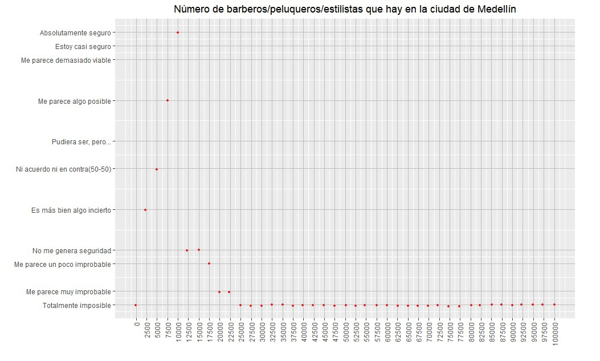
</center>

**Resumen de la elicitación**

Cuando se realizó la elicitación del número de barberos, el experto consideraba que había una buena cantidad de barberos, ya que el gremio ha crecido mucho, y hay gran variedad de cursos y escuelas que enseñan de manera fácil esta profesión; él menciona que anteriormente era común ver solo peluquerías, hoy en día se puede encontrar una gran cantidad de locales de barbería y otros que prestan sus servicios a domiciolio; inicialmente su máximo valor fue de diez mil barberos/peluqueros/estilistas en Medellín y considera que eso es suficiente para satisfacer la demanda y está abierto a que seguirá creciendo el número de barberos o que incluso hay más barberos.


<br>

**Elicitación 2**

<center>
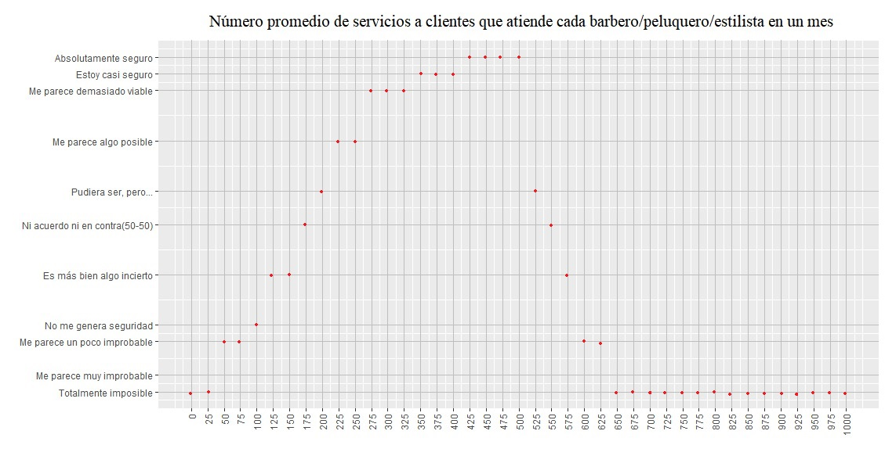
</center>

**Resumen de la elicitación**

Para elicitar el número de servicios el experto consideraba que era imposible que un barbero prestara tan pocos servicios, poco para él eran menos de 100 servicios al mes,  ya que el arte de la barbería demanda mucha gente, pero también consideraba que era muy difícil que un barbero realizara más de 600 servicios en un mes, por el desgaste que implicaría para la persona, por lo que teniendo en cuenta cuantos servicios realiza él al mes y sus compañeros, llego a que lo más probable es que un barbero realice al mes entre 425 y 500 servicios mensualmente.

<br>

**Elicitación 3**

<center>

</center>

<br>

**Resumen de la elicitación**

Cuando se le preguntó al experto 3 por el ingreso promedio por servicio, se le pidió que imaginara una muestra de 1000 barberos que incluían a todo tipo de barberos/peluqueros/estilistas; él mencionó conocer algunos que trabajan en centros comerciales y otros que trabajan en barrios más populares, pero que generalmente hay un precio base para los servicios prestados, sin embargo, es consiente de que hay algunos que cobran bastante más costosos, aunque, no son mayoría y corresponden a barberos que trabajan en zonas más exclusivas de ciudad; por lo que pensando en la mayoría, asigna 300 barberos que cobrarían entre 12501 y 15000, por lo que en un servicio generalmente se realizan varias cosas, además de un corte.


<br>

**Conclusión:**

Los tres expertos se sentian muy motivados por lo que ejercen, es algo que de verdad quieren seguir haciendo y los tres lo describen como un arte, del cual aprenden cada dia cosas nuevas y además a su consideración es algo que nunca va a decaer, ya que a los hombres siempre les va a seguir creciendo el cabello y ahi van a estar ellos siempre para ayudar, por lo tanto es un sector que va a seguir teniendo gran influencia y va a aportar a la economia.

## Cambios de opinión

Al cabo de unos dias se le hablo a cada uno de los expertos y se les pregunto si habian cambiado de opinión respecto a las estimaciones que hicieron en cada una de las elicitaciones:

**Experto 1.**

<center>
{width=25% height=40%}
</center>

Como se puede ver en la conversación que se entablo con el Experto 1 este sigue firme con sus opiniones sobre cada una de las estimaciones que realizo sobre las tres variables estudiadas, por lo tanto las elicitaciones son las mismas descritas previamente.


**Experto 2.**

<center>
{width=25% height=40%}
</center>

Como se puede ver en la conversación que se entablo con el Experto 2 este sigue firme con sus opiniones sobre cada una de las estimaciones que realizo sobre las tres variables estudiadas, por lo tanto las elicitaciones son las mismas descritas previamente.

<br>


**Experto 3.**

<center>
{width=25% height=40%}
</center>

<br>

Como se puede ver en la conversación que se entablo con el Experto 3 este sigue firme con sus opiniones sobre el número promedio de servicios y el costo promedio por servicio, pero cambia un poco de opinión sobre el número de barberos que hay en la ciudad de Medellín, con lo cual se le volvio a realizar el proceso de elicitación para esta y se muestra a continuación la nueva plantilla:


<center>

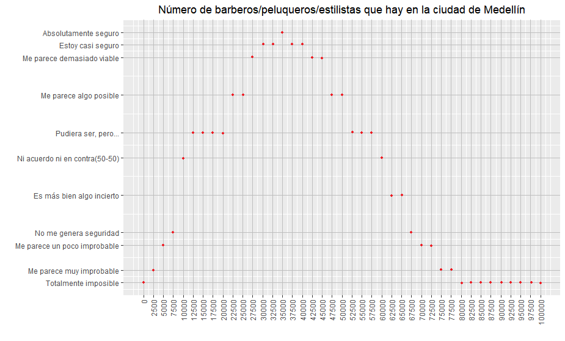

</center>

<br>

**Resumen de la elicitación**

Cuando se realizó la elicitación del número de barberos, el experto consideraba que había una buena cantidad de barberos, ya que el gremio ha crecido mucho, y hay gran variedad de cursos y escuelas que enseñan de manera fácil esta profesión, sin embargo, inicialmente su máximo valor fue de diez mil, esto fue cambiando,  debido a que él comenzó a pensar en que debían ser más, llegando como se observa a valores entre treinta mil y cuarenta mil barberos/peluqueros/estilistas en Medellín.


<br>

## Análisis de las distribuciones 

**Análisis del número de barberos/peluqueros/estilistas en la ciudad de Medellín**

Una aproximación de las distribuciones establecidas por cada uno de los expertos sobre el número de barberos/peluqueros/estilistas en la ciudad de Medellín se visualiza a continuación:


<center>

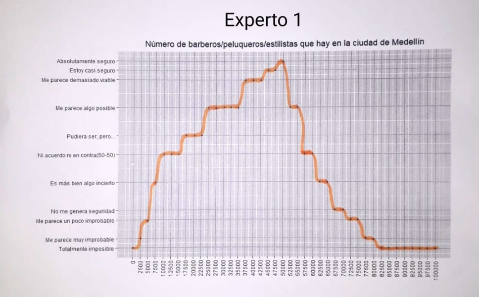{width=30% height=50%}
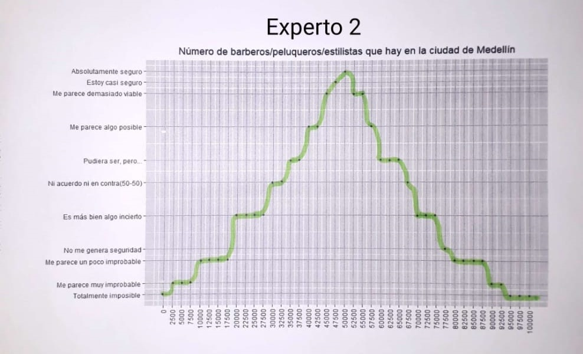{width=30% height=50%}
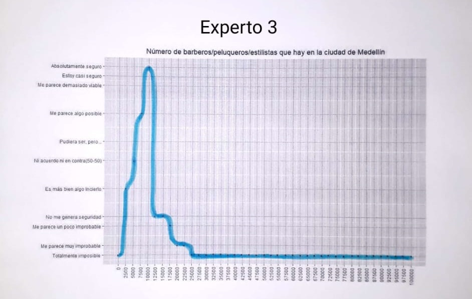{width=30% height=50%}

</center>

* Las cuales traducidas a datos se presentan en la siguiente data frame:

_Datos gráfico a mano alzada sobre el número de barberos/peluqueros/estilistas de la ciudad de Medellín_


<center>
```{r, echo=FALSE}
library(readxl)
Num_barberos <- read_excel("Num_barberos.xlsx")
Num_barberos <- data.frame(Num_barberos)

library(kableExtra)
kable(Num_barberos, caption = "Datos de las elicitaciones sobre el número de peluqueros/barberos/estilistas en Medellín") %>%
  kable_paper() %>%
  scroll_box(width = "100%", height = "200px")
```

</center>

<br>


### Gráfico de las distribuciones aprioris en cada uno de los expertos y su promedio

**distribución del número de barberos dada por el Experto 1**

```{r, echo=FALSE, fig.align='center'}
plot(Num_barberos$Num_barberos, Num_barberos$Experto1, type='l',sub='Número de Barberos/peluqeros/estilistas', pch=19, col="orange", main="Distribución del número de barberos para el Experto 1",lwd=2, xlab="", ylab="Nivel de seguridad", xaxt ="n")
axis(1, at=seq(0,100000, by=2500), las=2)
grid()
```

<br>

**distribución del número de barberos dada por el Experto 2**

```{r, echo=FALSE, fig.align='center'}
plot(Num_barberos$Num_barberos, Num_barberos$Experto2, type='l',ylab='Nivel de seguridad',xlab="", sub='Número de Barberos/peluqeros/estilistas', pch=19, col="green", main="Distribución del número de barberos para el Experto 2", lwd=2, xaxt ="n")
axis(1, at=seq(0,100000, by=2500), las=2)
grid()
```


**distribución del número de barberos dada por el Experto 3**

```{r, echo=FALSE, fig.align='center'}
plot(Num_barberos$Num_barberos, Num_barberos$Experto3, type='l',ylab='Nivel de seguridas',xlab='', sub='Cantidad de Barberos/peluqeros/estilistas', pch=19, col="cyan4", main="distribución del número de barberos para el Experto 3", lwd=2, xaxt ="n")
axis(1, at=seq(0,100000, by=2500), las=2)
grid()
```


<br>

```{r, echo=FALSE, fig.align='center'}
promedio_barberos <- rowMeans(data.frame(Num_barberos$Experto1, Num_barberos$Experto2, Num_barberos$Experto3))
```

<br>

**Distribución del número de barberos para los tres expertos y su promedio**

```{r, echo=FALSE}
# Proporciones en cada una de las muestras
res1<-prop.table(Num_barberos$Experto1)
res2<-prop.table(Num_barberos$Experto2)
res3<-prop.table(Num_barberos$Experto3)

# Mezclando muestras de los expertos
res4<-prop.table(promedio_barberos)
```

```{r, fig.align="center", echo=FALSE}
plot(Num_barberos$Num_barberos, res1, type='l',ylab='Densidad',xlab="",sub='Número de Barberos/peluqeros/estilistas', ylim = c(0, 0.07), pch=19, col="orange", xaxt="n")
axis(1, at=seq(0,100000, by=2500), las=2)
title(main='Número de expertos en cabellos masculinos en la ciudad de Medellín')
points(Num_barberos$Num_barberos,res2,type='l',col='green', pch=19)
points(Num_barberos$Num_barberos,res3,type='l',col='cyan4', pch=19)
points(Num_barberos$Num_barberos,res4,type='l',col='red', pch=19, lwd=2)
grid()
legend("topright",c('Experto 1','Experto 2','Experto3','Promedio'),lty=c(1,1,1,1),
col=c('orange','green','cyan4','red'))
```

* La distribución promedio que se presenta en esta gráfica es dandole el mismo peso a los tres expertos, pero esto no es adecuado ya que ellos no tienen el mismo nivel de experiencia o experticie en el tema, por tanto mediante simulación se pretende sacar muestras con un tamaño de muestra equivalente al nivel de experticie de cada uno.

<br>

_Para todas las simulaciones que se van a realizar previamente se va a utilizar un argumento que es el número de muestras equivalentes, que es extraido mediante la siguiente tabla_

<center>
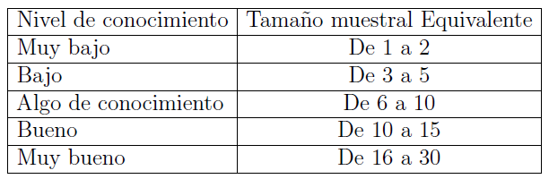
</center>

Para cada uno de los expertos se asignan cada uno de las siguiente muestras equivalente:

* Experto 1: 7
* Experto 2: 14
* Experto 3: 9


# Simulación

Se realizan simulaciones del número de barberos para cada uno de los expertos, en donde se toma una muestra de tamaño $1000*n~seguridad$ donde $n~seguridad$ es el tamaño muestral equivalente a los años de experiencia que tiene en el campo cada uno de los expertos, de tal manera que se le da mayor peso al que más años de experiencia lleva en el campo, porque se espera que entre más años lleve tiene un conocimiento más acertado.

<br>

**Experto 1**

A este experto se le brinda un $n$ equivalente de $7$ dado que tiene algo de conocimiento en el tema

Se saca una muestra de tamaño 7000 con reemplazo de la información suministrada por el experto 1 considerando las probabilidades de cada valor de acuerdo a la altura presente en la elicitación.


```{r, echo=FALSE}
#Muestra experto 1
Nsim <-1000
n.seguridad1 <- 7
muestra1<-sample(Num_barberos[,1],Nsim*n.seguridad1,replace=T,prob=Num_barberos$Experto1)
```


```{r, echo=FALSE}
length(muestra1)
summary(muestra1)
```

<br>

**Experto 2**

A este experto se le brinda un $n$ equivalente de $14$ dado que tiene buen conocimiento en el tema

Se saca una muestra de tamaño 14000 con reemplazo de la información suministrada por el experto 2 considerando las probabilidades de cada valor de acuerdo a la altura presente en la elicitación.

```{r, echo=FALSE}
#Muestra experto 2
Nsim <-1000
n.seguridad2 <- 14
muestra2<-sample(Num_barberos[,1],Nsim*n.seguridad2,replace=T,prob=Num_barberos$Experto2)
```

<br>

**Experto 3**

A este experto se le brinda un $n$ equivalente de $9$ dado que tiene algo de conocimiento en el tema

Se saca una muestra de tamaño 9000 con reemplazo de la información suministrada por el experto 3 considerando las probabilidades de cada valor de acuerdo a la altura presente en la elicitación.

```{r, echo=FALSE}
#Muestra experto 3
Nsim <-1000
n.seguridad3 <- 9
muestra3<-sample(Num_barberos[,1],Nsim*n.seguridad3,replace=T,prob=Num_barberos$Experto3)
```


```{r echo=FALSE}
# Mezclando muestras de los expertos
res4<-prop.table(table(c(muestra1,muestra2, muestra3)))
```

<br>


**Distribución del número de barberos para los tres expertos y su promedio mediante simulación**

```{r, fig.align="center", echo=FALSE}
plot(prop.table(table(muestra1)), type='l',ylab='Densidad',xlab="",sub='Número de Barberos/peluqeros/estilistas', pch=19, col="orange", ylim = c(0, 0.07), lwd = 1, las=2)
title(main='Número de expertos en cabellos masculinos en la ciudad de Medellín')
points(prop.table(table(muestra2)),type='l',col='green', pch=19, lwd = 1)
points(prop.table(table(muestra3)),type='l',col='cyan4', pch=19,lwd = 1)
points(sort(unique(c(muestra1,muestra2, muestra3))),res4,type='l',col='red', pch=19, lwd = 2)
grid()
legend("topright",c('Experto 1','Experto 2','Experto3','Promedio'),lty=c(1,1,1,1),
col=c('orange','green','cyan4','red'))
```

* De la distribución roja que es la promedio se van a sacar 1000 muestras de tamaño $n$ equivalente  que va a ser un tamaño de muestra promedio de los tamaños de muestra equivalentes que le corresponden a cada experto, es decir:

Los $n$ equivalentes de cada experto son:

* Experto 1: $7$
* Experto 2: $14$
* Experto 3: $9$


$$n=\frac{7+14+9}{3}=\frac{30}{3}=10$$

Por lo tanto se van a tomar 1000 muestras de tamaño 10 de la distribución promedio del número de peluqueros en la ciudad de Medellín de tal manera que en cada una de las muestras de tamaño 10 se va a sacar la mediana que va a ayudar a obtener una nueva distribución más precisa del número real de peluqueros en la ciudad de Medellín


```{r, echo=FALSE}
promedio <- sort(unique(c(muestra1,muestra2, muestra3)))
probabilidades <- prop.table(table(c(muestra1,muestra2, muestra3)))
N.sim <- 1000
n.seguridad <- 10
medias_barberos<-apply(matrix(
  sample(promedio,Nsim*n.seguridad,replace=T,prob=probabilidades),
  ncol=n.seguridad),1,mean)
```

<br>

### Gráfica de la distribución promedio del número de peluqueros que hay en la ciudad de Medellín

```{r, echo=FALSE, fig.align="center"}
hist(medias_barberos,xlab='', sub="Número de peluqueros", ylab='Densidad', main='Distribución promedio del número de peluqueros en Medellín', col="cyan3", freq = FALSE, xaxt="n")
axis(1, at=seq(min(medias_barberos), max(medias_barberos), by=2500), las=2)
lines(density(medias_barberos, from=0), lwd=1.5)
grid()

```

```{r}
summary(medias_barberos)
```
```{r}
sd(medias_barberos)
```


* Se puede notar que se empezo el análisis del número de peluqueros con un rango de 0 a 100 mil, pero mediante esta distribución promedio ya se tiene un rango más cerrado que va de 24000 y 63250 que es el rango en donde se espera que este el número real de peluqueros de la ciudad de Medellín.

* La estimación promedio del número de barberos/peluqueros/estilistas que hay en la ciudad de Medellín es de 42460. (Esta seria la estimación puntual) 

* Hay una dispersión de 5770.831 unidades en las estimaciones del número de barberos/peluqeros/estilistas de la ciudad de Medellín.


```{r}
round(quantile(medias_barberos, prob=c(0.025, 0.975)))
```

* Con una probabilidad del 95% el número real de barberos/peluqueros/estilistas que hay en la ciudad de Medellín esta entre 31750 y 53756 personas.


<br>

<hr>


**Análisis del número de servicios en un mes que ofrecen los barberos/peluqueros/estilistas en la ciudad de Medellín**


Una aproximación de las distribuciones establecidas por cada uno de los expertos sobre el número de servicios en un mes se visualiza a continuación:


<center>

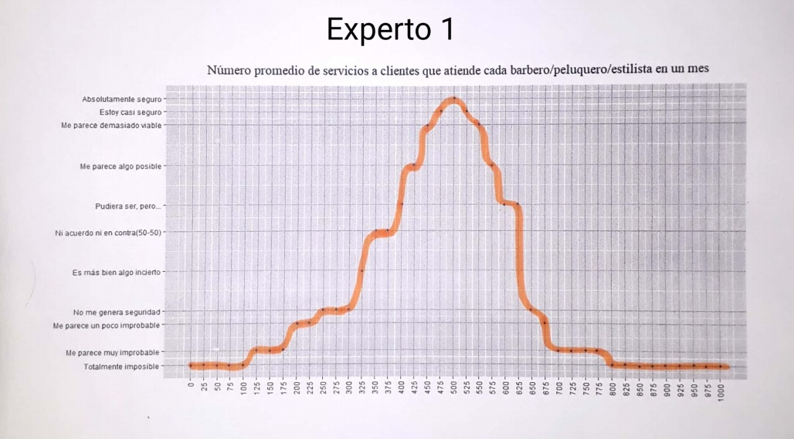{width=30% height=50%}
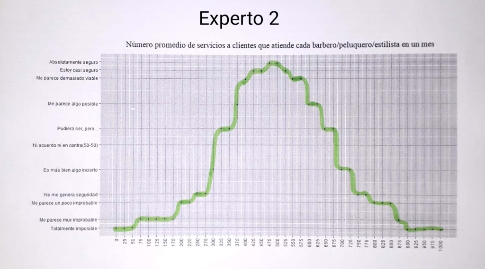{width=30% height=50%}
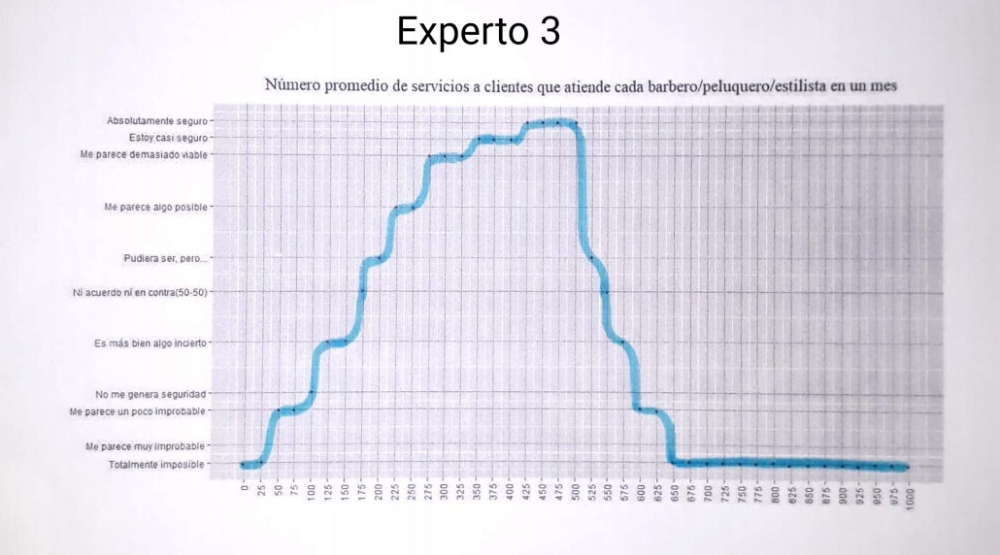{width=30% height=50%}

</center>

* Las cuales traducidas a datos se presentan en la siguiente data frame:


_Datos gráfico a mano alzada sobre el número de clientes que atienden barberos/peluqueros/estilistas de la ciudad de Medellín_
<center>
```{r, echo=FALSE}
library(readxl)
Num_clientes <- read_excel("Num_clientes.xlsx")
Num_clientes <- data.frame(Num_clientes)

kable(Num_clientes, caption = "Datos de las elicitaciones sobre el número de peluqueros/barberos/estilistas en Medellín") %>%
  kable_paper() %>%
  scroll_box(width = "100%", height = "200px")
```

</center>

<br>

### Gráfico de las distribuciones aprioris en cada uno de los expertos y su promedio

distribución del número de servicios en un mes para el Experto 1

```{r, echo=FALSE, fig.align="center"}
plot(Num_clientes$Num_clientes, Num_clientes$Experto1, type='l',ylab='Nivel de seguridad',xlab='Cantidad de servicios en un mes', pch=19, col="orange", main="Distribución del número de servicios en un mes por el Experto 1", xaxt="n", lwd=2)
axis(1, at=seq(0, 1000, 25), las=2)
grid()
```


distribución del número de servicios en un mes  para el Experto 2

```{r, echo=FALSE, fig.align="center"}
plot(Num_clientes$Num_clientes, Num_clientes$Experto2, type='l',ylab='Nivel de seguridad',xlab='Cantidad de servicios en un mes', pch=19, col="green", main="Distribución del número de servicios en un mes por el Experto 2", lwd=2, xaxt="n")
axis(1, at=seq(0, 1000, 25), las=2)
grid()
```


distribución del número de servicios en un mes  para el Experto 3

```{r, echo=FALSE, fig.align="center"}
plot(Num_clientes$Num_clientes, Num_clientes$Experto3, type='l',ylab='Nivel de seguridad',xlab='Cantidad de servicios en un mes', pch=19, col="purple", main="Distribución del número de servicios en un mes por el Experto 3", xaxt="n", lwd=2)
axis(1, at=seq(0, 1000, 25), las=2)
grid()
```

<br>

Distribución del número de servicios por mes en la ciudad de Medellín y su promedio

```{r, echo=FALSE, fig.align="center"}
promedio_clientes <- rowMeans(data.frame(Num_clientes$Experto1, Num_clientes$Experto2, Num_clientes$Experto3))
```


```{r, echo=FALSE}
# Proporciones en cada una de las muestras
res1<-prop.table(Num_clientes$Experto1)
res2<-prop.table(Num_clientes$Experto2)
res3<-prop.table(Num_clientes$Experto3)

# Mezclando muestras de los expertos
res4<-prop.table(promedio_clientes)
```

```{r, fig.align="center", echo=FALSE}
plot(Num_clientes$Num_clientes, res1, type='l',ylab='Densidad',xlab='Número de servicios en un mes', ylim=c(0,0.1), pch=19, col="orange", xaxt="n")
axis(1, at=seq(0, 1000, 25), las=2)
title(main='Número de servicios en un mes de especialistas en cabello masculino')
points(Num_clientes$Num_clientes,res2,type='l',col='green', pch=19)
points(Num_clientes$Num_clientes,res3,type='l',col='cyan4', pch=19)
points(Num_clientes$Num_clientes,res4,type='l',col='red', pch=19, lwd=2)
grid()
legend("topright",c('Experto 1','Experto 2','Experto3','Promedio'),lty=c(1,1,1,1),
col=c('orange','green','cyan4','red'))
```


* La distribución promedio que se presenta en esta gráfica es dandole el mismo peso a los tres expertos, pero esto no es adecuado ya que ellos no tienen el mismo nivel de experiencia o experticie en el tema, por tanto mediante simulación se pretende sacar muestras con un tamaño de muestra equivalente al nivel de experticie de cada uno.

<br>

# Simulación

Se realizan simulaciones del número de servicios peomedio en un mes para cada uno de los expertos, en donde se toma una muestra de tamaño $1000*n~seguridad$ donde $n~seguridad$ es el tamaño muestral equivalente a los años de experiencia que tiene en el campo cada uno de los expertos, de tal manera que se le da mayor peso al que más años de experiencia lleva en el campo, porque se espera que entre más años lleve tiene un conocimiento más acertado.


**Experto 1**


A este experto se le brinda un $n$ equivalente de $7$ dado que tiene algo de conocimiento en el tema

Se saca una muestra de tamaño 7000 con reemplazo de la información suministrada por el experto 1 considerando las probabilidades de cada valor de acuerdo a la altura presente en la elicitación.


```{r, echo=FALSE}
#Muestra experto 1
Nsim <-1000
n.seguridad1 <- 7
muestra1<-sample(Num_clientes[,1],Nsim*n.seguridad1,replace=T,prob=Num_clientes$Experto1)
```

<br>

**Experto 2**

Se saca una muestra de tamaño 14000 con reemplazo de la información suministrada por el experto 2 considerando las probabilidades de cada valor de acuerdo a la altura presente en la elicitación.

```{r, echo=FALSE}
#Muestra experto 2
Nsim <-1000
n.seguridad2 <- 14
muestra2<-sample(Num_clientes[,1],Nsim*n.seguridad2,replace=T,prob=Num_clientes$Experto2)
```

<br>

**Experto 3**

Se saca una muestra de tamaño 9000 con reemplazo de la información suministrada por el experto 3 considerando las probabilidades de cada valor de acuerdo a la altura presente en la elicitación.

```{r, echo=FALSE}
#Muestra experto 1
Nsim <-1000
n.seguridad3 <- 9
muestra3<-sample(Num_clientes[,1],Nsim*n.seguridad3,replace=T,prob=Num_clientes$Experto3)
```

```{r, echo=FALSE}
# Mezclando muestras de los expertos
res4<-prop.table(table(c(muestra1,muestra2, muestra3)))
```

<br>


Distribución del número de servicios en un mes para los tres expertos y su promedio

```{r, fig.align="center", echo=FALSE}
plot(prop.table(table(muestra1)), type='l',ylab='Densidad',xlab='Número de servicios en un mes', pch=19, col="orange", lwd = 1, xaxt="n")
axis(1, at=seq(0, 1000, 25), las=2)
title(main='Número de servicios en un mes de especialistas en cabello masculino')
points(prop.table(table(muestra2)),type='l',col='green', pch=19, lwd = 1)
points(prop.table(table(muestra3)),type='l',col='cyan4', pch=19,lwd = 1)
points(sort(unique(c(muestra1,muestra2, muestra3))),res4,type='l',col='red', pch=19, lwd = 2)
grid()
legend("topright",c('Experto 1','Experto 2','Experto3','Promedio'),lty=c(1,1,1,1),
col=c('orange','green','cyan4','red'))
```


* De la distribución roja que es la promedio se van a sacar 1000 muestras de tamaño $n$ equivalente que va a ser un tamaño de muestra promedio de los tamaños de muestra equivalentes que le corresponden a cada experto es decir:

Los $n$ equivalentes de cada experto son:

* Experto 1: $7$
* Experto 2: $14$
* Experto 3: $9$


$$n=\frac{7+14+9}{3}=\frac{30}{3}=10$$

Por lo tanto se van a tomar 1000 muestras de tamaño 10 de la distribución promedio del número de servicios en un mes de tal manera que en cada una de las muestras de tamaño 10 se va a sacar un promedio que va a ayudar a obtener una nueva distribución más precisa del número real de servicios en el mes de los peluqueros en la ciudad de Medellín


```{r, echo=FALSE}
promedio <- sort(unique(c(muestra1,muestra2, muestra3)))
probabilidades <- prop.table(table(c(muestra1,muestra2, muestra3)))
N.sim <- 1000
n.seguridad <- 10
medias_clientes<-apply(matrix(
  sample(promedio,Nsim*n.seguridad,replace=T,prob=probabilidades),
  ncol=n.seguridad),1,mean)
```

<br>

### Gráfica de la distribución del número de servicios promedio en un mes de peluqueros en la ciudad de Medellín

```{r, echo=FALSE, fig.align="center"}
hist(medias_clientes,xlab='', sub="Número de servicios en un mes", ylab='Densidad', main='Distribución promedio del número de servicios en un mes', col="cyan3", freq = FALSE, xaxt="n")
axis(1, at=seq(300, 600, by=25), las=2)
lines(density(medias_clientes, from=0), lwd=1.5)
grid()
```

```{r}
summary(medias_clientes)
```

```{r}
sd(medias_clientes)
```


* Se puede notar que se empezo el análisis del número de servicios en un mes con un rango de 0 a 1000, pero mediante esta distribución promedio ya se tiene un rango más cerrado que va de aproximadamente de 305 a 590 servicios que es el rango en donde se espera que este el número real de servicios en un mes de peluqueros de la ciudad de Medellín.

* La estimación promedio del número de servicios que ofrecen al mes los barberos/peluqueros/estilistas en la ciudad de Medellín es de aproximadamente 453 servicios.

* Hay una dispersión de 47.366 unidades en las estimaciones del número de servicios en un mes de barberos/peluqeros/estilistas de la ciudad de Medellín.

```{r}
quantile(medias_clientes, probs = c(0.025, 0.975))
```

* Con una probabilidad del 95%, el número de servicios promedio en un mes real que ofrecen los barberos/peluqueros/estilistas de la ciudad de Medellín esta entre 360 y 550 servicios.

<br>

<hr>

**Análisis del costo promedio por servicio que ofrecen los barberos/peluqueros/estilistas en la ciudad de Medellín**


Las plantillas de elicitación establecidas por cada uno de los expertos sobre el costo promedio por servicio se visualiza a continuación:


<center>


<br>


<br>


</center>

* Las cuales traducidas a datos se presentan en la siguiente data frame:

_Datos gráfico elicitación via muestras hipoteticas del costo por servicio_

<center>
```{r, echo=FALSE}
library(readxl)
Precios <- read_excel("Precio.xlsx")
Precios <- data.frame(Precios)

kable(Precios, caption = "Datos de las elicitaciones sobre el costo por servicio de peluqueros/barberos/estilistas en Medellín") %>%
  kable_paper() %>%
  scroll_box(width = "100%", height = "200px")
```

</center>
<br>


### Gráfico de las distribuciones aprioris en cada uno de los expertos y su promedio

Distribución del costo por servicio para el Experto 1

```{r, fig.align="center", echo=FALSE}
plot(Precios$Costo, Precios$Experto1, type = "l", col="orange", main="Distribución del costo por servicio Experto 1", ylab="Nivel de seguridad", xlab="", sub="Costos", xaxt="n", lwd=2)
axis(1, at=seq(0, 50000, 500), las=2)
grid()
```

<br>

Distribución del costo por servicio para el Experto 2


```{r, fig.align="center", echo=FALSE}
plot(Precios$Costo, Precios$Experto2, type = "l", col="green", main="Distribución del costo por servicio Experto 2", ylab="Nivel de seguridad", xlab="", sub="Costos", xaxt="n", lwd=2)
axis(1, at=seq(0, 50000, 500), las=2)
grid()
```
<br>

Distribución del costo por servicio para el Experto 3

```{r, fig.align="center", echo=FALSE}
plot(Precios$Costo, Precios$Experto3, type = "l", col="cyan4", main="Distribución del costo por servicio Experto 3", ylab="Nivel de seguridad", xlab="", sub="Costos", xaxt="n", lwd=2)
axis(1, at=seq(0, 50000, 500), las=2)
grid()
```


```{r, fig.align="center", echo=FALSE}
res <- data.frame(Precios$Experto1, Precios$Experto2, Precios$Experto3)
promedio_Precios <- rowMeans(res)
```

<br>

**Distribución del costo por servicio para los tres expertos y su promedio**

```{r, fig.align="center", echo=FALSE}
plot(Precios$Costo, Precios$Experto1, type='l',ylab='Densidad',xlab="",sub='Costos', pch=19, col="orange", ylim = c(0, 450), xaxt="n")
axis(1, at=seq(0, 50000, 500), las=2)
title(main='Distribución del costo por servicio para los tres expertos y su promedio')
points(Precios$Costo,Precios$Experto2,type='l',col='green', pch=19)
points(Precios$Costo,Precios$Experto3,type='l',col='cyan4', pch=19)
points(Precios$Costo, promedio_Precios, col="red", pch=19, type = "l", lwd=2)
grid()
legend("topright",c('Experto 1','Experto 2','Experto3','Promedio'),lty=c(1,1,1,1),
col=c('orange','green','cyan4','red'))
```


* La distribución promedio que se presenta en esta gráfica es dandole el mismo peso a los tres expertos, pero esto no es adecuado ya que ellos no tienen el mismo nivel de experiencia o experticie en el tema, por tanto mediante simulación se pretende sacar muestras con un tamaño de muestra equivalente al nivel de experticie de cada uno.

<br>

# Simulación

Se realizan simulaciones del costo por servicio promedio en un mes para cada uno de los expertos, en donde se toma una muestra de tamaño $1000*n~seguridad$ donde $n~seguridad$ es el tamaño muestral equivalente a los años de experiencia que tiene en el campo cada uno de los expertos, de tal manera que se le da mayor peso al que más años de experiencia lleva en el campo, porque se espera que entre más años lleve tiene un conocimiento más acertado.

<br>

**Experto 1**

A este experto se le brinda un $n$ equivalente de $7$ dado que tiene algo de conocimiento en el tema

Se saca una muestra de tamaño 7000 con reemplazo de la información suministrada por el experto 1 considerando las probabilidades de cada valor de acuerdo a la altura presente en la elicitación.


```{r, echo=FALSE}
# Muestra experto 1
Nsim<-1000
n.seguridad1 <- 7
muestra1<-sample(Precios$Costo,Nsim*n.seguridad1,replace=T,prob=Precios$Experto1)
```

<br>

**Experto 2**

A este experto se le brinda un $n$ equivalente de $14$ dado que tiene buen conocimiento en el tema

Se saca una muestra de tamaño 14000 con reemplazo de la información suministrada por el experto 2 considerando las probabilidades de cada valor de acuerdo a la altura presente en la elicitación.


```{r, echo=FALSE}
# Muestra experto 2
Nsim<-1000
n.seguridad2 <- 14
muestra2<-sample(Precios$Costo,Nsim*n.seguridad2,replace=T,prob=Precios$Experto2)
```

<br>

**Experto 3**

A este experto se le brinda un $n$ equivalente de $9$ dado que tiene algo de conocimiento en el tema

Se saca una muestra de tamaño 9000 con reemplazo de la información suministrada por el experto 3 considerando las probabilidades de cada valor de acuerdo a la altura presente en la elicitación.

```{r, echo=FALSE}
# Muestra experto 3
Nsim<-1000
n.seguridad3 <- 9
muestra3<-sample(Precios$Costo,Nsim*n.seguridad3,replace=T,prob=Precios$Experto3)
```


```{r, echo=FALSE}
# Mezclando muestras de los expertos
res4<-prop.table(table(c(muestra1,muestra2, muestra3)))
```

<br>


Distribución del costo por servicio para los tres expertos y su promedio

```{r, fig.align="center", echo=FALSE}
plot(prop.table(table(muestra1)), type='l',ylab='Densidad', xlab="",sub='Costo por servicio', pch=19, col="orange", ylim = c(0, 0.1), lwd = 1, xaxt="n")
axis(1, at=seq(0, 50000, 500), las=2)
title(main='Costo por servicio de barberos/peluqueros/estilistas de Medellín')
points(prop.table(table(muestra2)),type='l',col='green', pch=19, lwd = 1)
points(prop.table(table(muestra3)),type='l',col='cyan4', pch=19,lwd = 1)
points(sort(unique(c(muestra1,muestra2, muestra3))),res4,type='l',col='red', pch=19, lwd = 2)
grid()
legend("topright",c('Experto 1','Experto 2','Experto3','Promedio'),lty=c(1,1,1,1),
col=c('orange','green','cyan4','red'))
```

* De la distribución roja que es la promedio se van a sacar 1000 muestras de tamaño $n$ equivalente que va a ser un tamaño de muestra promedio de los tamaños de muestra equivalentes que le corresponden a cada experto es decir:

Los $n$ equivalentes de cada experto son:

Experto 1: $7$
Experto 2: $14$
Experto 3: $9$


$$n=\frac{7+14+9}{3}=\frac{30}{3}=10$$

Por lo tanto se van a tomar 1000 muestras de tamaño 10 de la distribución promedio del costo por servicio de tal manera que en cada una de las muestras de tamaño 10 se va a sacar un promedio que va a ayudar a obtener una nueva distribución más precisa del número real del costo del servicio de los peluqueros en la ciudad de Medellín


```{r, echo=FALSE}
promedio <- sort(unique(c(muestra1,muestra2, muestra3)))
probabilidades <- prop.table(table(c(muestra1,muestra2, muestra3)))
N.sim <- 1000
n.seguridad <- 10
medias_costos<-apply(matrix(
  sample(promedio,Nsim*n.seguridad,replace=T,prob=probabilidades),
  ncol=n.seguridad),1,mean)
```


<br>

### Gráfica de la distribución del costo por servicio promedio de peluqueros en la ciudad de Medellín

```{r, echo=FALSE, fig.align="center"}
hist(medias_costos,xlab='', sub="Costo", ylab='Densidad', main='Distribución promedio del costo por servicio de peluqueros', col="cyan3", freq = FALSE, xaxt="n")
axis(1, at=seq(6000, 19000, by=500), las=2)
lines(density(medias_costos, from=0), lwd=1.5)
grid()
```

```{r}
summary(medias_costos)
```

```{r}
sd(medias_costos)
```


* Se puede notar que se empezo el análisis del costo por servicio con un rango de 0 a 50 mil, pero mediante esta distribución promedio ya se tiene un rango más cerrado que va de aproximadamente de 7200 a 18900 (costo por servicio) que es el rango en donde se espera que este el número real del costo por servicio de peluqueros de la ciudad de Medellín.

* El costo promedio por servicio de los barberos/peluqueros/estilistas de la ciudad de Medellín es de 12329 que aproximadamente 12'350 pesos colombianos.

* Hay una dispersión de 1992.085 unidades en las estimaciones del costo promedio por servicio de barberos/peluqeros/estilistas de la ciudad de Medellín.


```{r}
quantile(medias_costos, prob=c(0.025, 0.975))
```

* Con una probabilidad del 95% el costo promedio por servicio real de barberos/peluqueros/estilistas de la ciudad de Medellín esta entre 9100 y 16900 pesos colombianos.

<br>


<hr>

## Estimación de la variable de intéres

**Ahora se va a realizar la estimación de la variable que era el verdadero interés de este estudio**

<center> <h4> "Ingreso total del sector al mes" </h4> </center>

El Ingreso total generado por el sector es una variable aleatoria con una distribución que sale a partir de las otras variables estudiadas, que es el número de barberos/peluqueros/estilistas en la ciudad de Medellín, el número promedio de servicios que ellos ofrecen en un mes y el costo por servicio, es decir el Ingreso total del sector sale como un producto de las anteriores tres variables mencionadas:

$$Ingreso~Total=Nro. Peluqueros \times Nro. Servicios \times Precio~Promedio~por~Servicio$$

Por lo tanto para el calculo de la distribución del ingreso total se aplicará la siguiente estrategia:


1. Se extrae de manera aleatoria un valor de la distribución del Número de peluqueros
2. Se extrae de manera aleatoria un valor de la distribución del Número promedio de servicios en un mes.
3. Se extrae de manera aleatoria un valor de la distribución del Costo promedio por servicio
4. Se realiza el producto de las muestras sacadas en los tres pasos anteriores que será un valor muestral para el ingreso total.
5. Se repiten los pasos anteriores muchas veces de tal manera que se obtiene una muestra grande para el ingreso total del sector y mediante esta poder elaborar la distribución (Histograma) y realizar inferencias sobre esta variable.

(la muestra para cada uno se extrae de la distribución promedio creada finalmente mediante simulación, de tal manera que esta tiene un tamaño de muestra equivalente para cada experto).


## Calculando la distribución del ingreso total en un mes del sector

Se toma una muestra de tamaño 1000 para el ingreso total por sector, que es calculado como el producto de las tres muestra extraidas para cada una de las otras variable (Número peluqueros, Número de servicios, Costo por servicio)

```{r, echo=F}
Tam_muestra <- 1000

Numero_barberos <- sample(medias_barberos, Tam_muestra, replace = T)
Numero_clientes <- sample(medias_clientes, Tam_muestra, replace = T)
Precio_servicio <- sample(medias_costos, Tam_muestra, replace = T)

Ingresos_sector <- Numero_barberos*Numero_clientes*Precio_servicio
```


<br>

**Distribución del ingreso total por mes del sector de peluqueros de la ciudad de Medellín**

```{r, echo=FALSE, fig.align="center"}
hist(Ingresos_sector,xlab='Ingresos', ylab='Densidad', main='Histograma del Ingreso total del sector de peluqueros', col="cyan3", freq = FALSE)
#axis(1, at=seq(min(Ingresos_sector), max(Ingresos_sector), by=82170312500), las=2)
lines(density(Ingresos_sector, from=0), lwd=1.5)
```


```{r}
summary(Ingresos_sector)
```

* En promedio el ingreso del sector de barberos/peluqueros/estilistas/ en un mes es de 236.800.000.000 (docientos treinta y seis mil ochocientos millones) pesos colombianos.


## Intervalo de probabilidad 

```{r}
quantile(Ingresos_sector, probs = c(0.025, 0.975))
```

* Con una probabilidad del 95% el valor del ingreso del sector debarberos/peluqueros/estilistas/ en un mes esta entre **146.340.801.563** y **348.892.559.375** pesos colombianos.


<br>
<hr>

## Referencias


* Flórez Rivera, A. (2014). ELICITACIÓN DE UNA DISTRIBUCIÓN SUBJETIVA DEL VECTOR DE PARÁMETROS PI DE LA DISTRIBUCIÓN MULTINOMIAL (Magister en Estadística). Universidad Nacional de Colombia.


* Lora, D. (2020, 20 agosto). ESTILISTA, BARBERO O PELUQUERO, ¿CUÁL ES LA DIFERENCIA? SoyMacho.com. https://www.soymacho.com/blogs/blog/diferencia-estilista-barbero-peluquero#:%7E:text=Persona%20que%20tiene%20por%20oficio,tan%20fino%20como%20los%20estilistas

* Medellín Barrios y Comunas. (s. f.). [Ilustracion]. Wikimedia. https://upload.wikimedia.org/wikipedia/commons/6/6a/Mapa_medellin_barrios_comunas_zonas_%28completo%29.svg


* Zambrano Benavides, D. (2020, 22 marzo). ¿Y qué fue de los barberos de Medellín en medio de la cuarentena? El Colombiano. https://www.elcolombiano.com/antioquia/barberos-de-medellin-le-hacen-el-corte-a-la-crisis-BO12856447

<br>
<hr>

### Códigos de R utilizados

Códigos para hacer las plantillas de elicitación:

* Plantilla 1

```{r, fig.align="center"}
library(ggplot2)
x <- seq(0, 100000, by=1000)
y <- seq(0, 100, by=1)
datos <- data.frame(x,y)
par(pty="s")
ggplot(datos, aes(x,y))+ 
  scale_y_continuous(breaks=c(0,5,15,20,35,50,60,75,90,95,100), labels = c("Totalmente imposible", "Me parece muy improbable", "Me parece un poco improbable", "No me genera seguridad", "Es más bien algo incierto", "Ni acuerdo ni en contra(50-50)", "Pudiera ser, pero...", "Me parece algo posible", "Me parece demasiado viable", "Estoy casi seguro", "Absolutamente seguro"), name=" ") +
  scale_x_continuous(breaks=seq(0, 100000, 2500), name=" ")+
  theme(axis.text.x = element_text(angle = 90, vjust = 0.5, hjust=1))+
  geom_vline(xintercept=seq(0, 100000, 2500), color="gray")+
  geom_hline(yintercept=c(0,5,15,20,35,50,60,75,90,95,100), color="gray")+
  ggtitle ("Número de barberos/peluqueros/estilistas que hay en la ciudad de Medellín")+
  theme(plot.title = element_text(hjust = 0.5))
```

<br>

* Plantilla 2

```{r, fig.align="center"}
library(ggplot2)
x <- seq(0, 1000, by=10)
y <- seq(0, 100, by=1)
datos <- data.frame(x,y)
par(pty="s")
ggplot(datos, aes(x,y))+ 
  scale_y_continuous(breaks=c(0,5,15,20,35,50,60,75,90,95,100), labels = c("Totalmente imposible", "Me parece muy improbable", "Me parece un poco improbable", "No me genera seguridad", "Es más bien algo incierto", "Ni acuerdo ni en contra(50-50)", "Pudiera ser, pero...", "Me parece algo posible", "Me parece demasiado viable", "Estoy casi seguro", "Absolutamente seguro"), name=" ") +
  scale_x_continuous(breaks=seq(0, 1000, 25), name=" ")+
  theme(axis.text.x = element_text(angle = 90, vjust = 0.5, hjust=1))+
  geom_vline(xintercept=seq(0, 1000, 25), color="gray")+
  geom_hline(yintercept=c(0,5,15,20,35,50,60,75,90,95,100), color="gray")+
  ggtitle ("Número promedio de servicios a clientes que atiende cada barbero/peluquero/estilistas en un mes")+
  theme(plot.title = element_text(hjust = 0.5))
```


<br>

* Plantilla 3.

Esta fue realizada mediante excel


<br>


* Lectura del conjunto de datos para la elicitación del número de peluqueros

```{r}
library(readxl)
Num_barberos <- read_excel("Num_barberos.xlsx")
Num_barberos <- data.frame(Num_barberos)

library(kableExtra)
kable(Num_barberos, caption = "Datos de las elicitaciones sobre el número de peluqueros/barberos/estilistas en Medellín") %>%
  kable_paper() %>%
  scroll_box(width = "100%", height = "200px")
```


<br>

* Gráficas de las distribuciones del número de peluqueros realizada por cada experto


**distribución del número de barberos dada por el Experto 1**

```{r fig.align='center'}
plot(Num_barberos$Num_barberos, Num_barberos$Experto1, type='l',sub='Número de Barberos/peluqeros/estilistas', pch=19, col="orange", main="Distribución del número de barberos para el Experto 1",lwd=2, xlab="", ylab="Nivel de seguridad", xaxt ="n")
axis(1, at=seq(0,100000, by=2500), las=2)
grid()
```

<br>

**distribución del número de barberos dada por el Experto 2**

```{r fig.align='center'}
plot(Num_barberos$Num_barberos, Num_barberos$Experto2, type='l',ylab='Nivel de seguridad',xlab="", sub='Número de Barberos/peluqeros/estilistas', pch=19, col="green", main="Distribución del número de barberos para el Experto 2", lwd=2, xaxt ="n")
axis(1, at=seq(0,100000, by=2500), las=2)
grid()
```


**distribución del número de barberos dada por el Experto 3**

```{r fig.align='center'}
plot(Num_barberos$Num_barberos, Num_barberos$Experto3, type='l',ylab='Nivel de seguridas',xlab='', sub='Cantidad de Barberos/peluqeros/estilistas', pch=19, col="cyan4", main="distribución del número de barberos para el Experto 3", lwd=2, xaxt ="n")
axis(1, at=seq(0,100000, by=2500), las=2)
grid()
```


<br>
 
**Calculando la distribucón promedio**

```{r, fig.align='center'}
promedio_barberos <- rowMeans(data.frame(Num_barberos$Experto1, Num_barberos$Experto2, Num_barberos$Experto3))
```

<br>

**Distribución del número de barberos para los tres expertos y su promedio**

```{r}
# Proporciones en cada una de las muestras
res1<-prop.table(Num_barberos$Experto1)
res2<-prop.table(Num_barberos$Experto2)
res3<-prop.table(Num_barberos$Experto3)

# Mezclando muestras de los expertos
res4<-prop.table(promedio_barberos)
```

```{r, fig.align="center"}
plot(Num_barberos$Num_barberos, res1, type='l',ylab='Densidad',xlab="",sub='Número de Barberos/peluqeros/estilistas', ylim = c(0, 0.07), pch=19, col="orange", xaxt="n")
axis(1, at=seq(0,100000, by=2500), las=2)
title(main='Número de expertos en cabellos masculinos en la ciudad de Medellín')
points(Num_barberos$Num_barberos,res2,type='l',col='green', pch=19)
points(Num_barberos$Num_barberos,res3,type='l',col='cyan4', pch=19)
points(Num_barberos$Num_barberos,res4,type='l',col='red', pch=19, lwd=2)
grid()
legend("topright",c('Experto 1','Experto 2','Experto3','Promedio'),lty=c(1,1,1,1),
col=c('orange','green','cyan4','red'))
```

<br>

* Simulaciones del número de peluqueros

**Experto 1**

A este experto se le brinda un $n$ equivalente de $7$ dado que tiene algo de conocimiento en el tema

Se saca una muestra de tamaño 7000 con reemplazo de la información suministrada por el experto 1 considerando las probabilidades de cada valor de acuerdo a la altura presente en la elicitación.


```{r}
#Muestra experto 1
Nsim <-1000
n.seguridad1 <- 7
muestra1<-sample(Num_barberos[,1],Nsim*n.seguridad1,replace=T,prob=Num_barberos$Experto1)
```

<br>

**Experto 2**

A este experto se le brinda un $n$ equivalente de $14$ dado que tiene buen conocimiento en el tema

Se saca una muestra de tamaño 14000 con reemplazo de la información suministrada por el experto 2 considerando las probabilidades de cada valor de acuerdo a la altura presente en la elicitación.

```{r}
#Muestra experto 2
Nsim <-1000
n.seguridad2 <- 14
muestra2<-sample(Num_barberos[,1],Nsim*n.seguridad2,replace=T,prob=Num_barberos$Experto2)
```

<br>

**Experto 3**

A este experto se le brinda un $n$ equivalente de $9$ dado que tiene algo de conocimiento en el tema

Se saca una muestra de tamaño 9000 con reemplazo de la información suministrada por el experto 3 considerando las probabilidades de cada valor de acuerdo a la altura presente en la elicitación.

```{r}
#Muestra experto 3
Nsim <-1000
n.seguridad3 <- 9
muestra3<-sample(Num_barberos[,1],Nsim*n.seguridad3,replace=T,prob=Num_barberos$Experto3)
```


```{r}
# Mezclando muestras de los expertos
res4<-prop.table(table(c(muestra1,muestra2, muestra3)))
```

<br>


**Distribución del número de barberos para los tres expertos y su promedio mediante simulación**

```{r, fig.align="center"}
plot(prop.table(table(muestra1)), type='l',ylab='Densidad',xlab="",sub='Número de Barberos/peluqeros/estilistas', pch=19, col="orange", ylim = c(0, 0.07), lwd = 1, las=2)
title(main='Número de expertos en cabellos masculinos en la ciudad de Medellín')
points(prop.table(table(muestra2)),type='l',col='green', pch=19, lwd = 1)
points(prop.table(table(muestra3)),type='l',col='cyan4', pch=19,lwd = 1)
points(sort(unique(c(muestra1,muestra2, muestra3))),res4,type='l',col='red', pch=19, lwd = 2)
grid()
legend("topright",c('Experto 1','Experto 2','Experto3','Promedio'),lty=c(1,1,1,1),
col=c('orange','green','cyan4','red'))
```

<br>

**Simulacción de las 1000 muestras de tamaño 10 extraidad de la distribución promedio del número de peluqueros**

```{r}
promedio <- sort(unique(c(muestra1,muestra2, muestra3)))
probabilidades <- prop.table(table(c(muestra1,muestra2, muestra3)))
N.sim <- 1000
n.seguridad <- 10
medias_barberos<-apply(matrix(
  sample(promedio,Nsim*n.seguridad,replace=T,prob=probabilidades),
  ncol=n.seguridad),1,mean)
```

<br>

**Gráfica de la distribución promedio del número de peluqueros que hay en la ciudad de Medellín**

```{r fig.align="center"}
hist(medias_barberos,xlab='', sub="Número de peluqueros", ylab='Densidad', main='Distribución promedio del número de peluqueros en Medellín', col="cyan3", freq = FALSE, xaxt="n")
axis(1, at=seq(min(medias_barberos), max(medias_barberos), by=2500), las=2)
lines(density(medias_barberos, from=0), lwd=1.5)
grid()
```

**Medidas de resumen**

```{r}
summary(medias_barberos)
```

```{r}
sd(medias_barberos)
```

**Calculo del intervalo del 95% de probabilidad para el número de peluqueros**

```{r}
round(quantile(medias_barberos, prob=c(0.025, 0.975)))
```

<br>
<hr>


* Lectura del conjunto de datos para la elicitación del número de servicios en un mes


```{r}
library(readxl)
Num_clientes <- read_excel("Num_clientes.xlsx")
Num_clientes <- data.frame(Num_clientes)

kable(Num_clientes, caption = "Datos de las elicitaciones sobre el número de peluqueros/barberos/estilistas en Medellín") %>%
  kable_paper() %>%
  scroll_box(width = "100%", height = "200px")
```

<br>


* Gráfico de las distribuciones aprioris en cada uno de los expertos y su promedio

**distribución del número de servicios en un mes para el Experto 1**

```{r, fig.align="center"}
plot(Num_clientes$Num_clientes, Num_clientes$Experto1, type='l',ylab='Nivel de seguridad',xlab='Cantidad de servicios en un mes', pch=19, col="orange", main="Distribución del número de servicios en un mes por el Experto 1", xaxt="n", lwd=2)
axis(1, at=seq(0, 1000, 25), las=2)
grid()
```


**distribución del número de servicios en un mes  para el Experto 2**

```{r fig.align="center"}
plot(Num_clientes$Num_clientes, Num_clientes$Experto2, type='l',ylab='Nivel de seguridad',xlab='Cantidad de servicios en un mes', pch=19, col="green", main="Distribución del número de servicios en un mes por el Experto 2", lwd=2, xaxt="n")
axis(1, at=seq(0, 1000, 25), las=2)
grid()
```


**distribución del número de servicios en un mes  para el Experto 3**

```{r, fig.align="center"}
plot(Num_clientes$Num_clientes, Num_clientes$Experto3, type='l',ylab='Nivel de seguridad',xlab='Cantidad de servicios en un mes', pch=19, col="purple", main="Distribución del número de servicios en un mes por el Experto 3", xaxt="n", lwd=2)
axis(1, at=seq(0, 1000, 25), las=2)
grid()
```

<br>

**Calculando la distribucón promedio**

```{r, fig.align="center"}
promedio_clientes <- rowMeans(data.frame(Num_clientes$Experto1, Num_clientes$Experto2, Num_clientes$Experto3))
```

**Distribución del número de servicios por mes en la ciudad de Medellín y su promedio**

```{r}
# Proporciones en cada una de las muestras
res1<-prop.table(Num_clientes$Experto1)
res2<-prop.table(Num_clientes$Experto2)
res3<-prop.table(Num_clientes$Experto3)

# Mezclando muestras de los expertos
res4<-prop.table(promedio_clientes)
```

```{r, fig.align="center"}
plot(Num_clientes$Num_clientes, res1, type='l',ylab='Densidad',xlab='Número de servicios en un mes', ylim=c(0,0.1), pch=19, col="orange", xaxt="n")
axis(1, at=seq(0, 1000, 25), las=2)
title(main='Número de servicios en un mes de especialistas en cabello masculino')
points(Num_clientes$Num_clientes,res2,type='l',col='green', pch=19)
points(Num_clientes$Num_clientes,res3,type='l',col='cyan4', pch=19)
points(Num_clientes$Num_clientes,res4,type='l',col='red', pch=19, lwd=2)
grid()
legend("topright",c('Experto 1','Experto 2','Experto3','Promedio'),lty=c(1,1,1,1),
col=c('orange','green','cyan4','red'))
```


<br>

* Simulaciones del número de servicios en un mes

**Experto 1**


A este experto se le brinda un $n$ equivalente de $7$ dado que tiene algo de conocimiento en el tema

Se saca una muestra de tamaño 7000 con reemplazo de la información suministrada por el experto 1 considerando las probabilidades de cada valor de acuerdo a la altura presente en la elicitación.


```{r}
#Muestra experto 1
Nsim <-1000
n.seguridad1 <- 7
muestra1<-sample(Num_clientes[,1],Nsim*n.seguridad1,replace=T,prob=Num_clientes$Experto1)
```

<br>

**Experto 2**

Se saca una muestra de tamaño 14000 con reemplazo de la información suministrada por el experto 2 considerando las probabilidades de cada valor de acuerdo a la altura presente en la elicitación.

```{r}
#Muestra experto 2
Nsim <-1000
n.seguridad2 <- 14
muestra2<-sample(Num_clientes[,1],Nsim*n.seguridad2,replace=T,prob=Num_clientes$Experto2)
```

<br>

**Experto 3**

Se saca una muestra de tamaño 9000 con reemplazo de la información suministrada por el experto 3 considerando las probabilidades de cada valor de acuerdo a la altura presente en la elicitación.

```{r}
#Muestra experto 1
Nsim <-1000
n.seguridad3 <- 9
muestra3<-sample(Num_clientes[,1],Nsim*n.seguridad3,replace=T,prob=Num_clientes$Experto3)
```

```{r}
# Mezclando muestras de los expertos
res4<-prop.table(table(c(muestra1,muestra2, muestra3)))
```

<br>

**Distribución del número de servicios en un mes para los tres expertos y su promedio**

```{r, fig.align="center"}
plot(prop.table(table(muestra1)), type='l',ylab='Densidad',xlab='Número de servicios en un mes', pch=19, col="orange", lwd = 1, xaxt="n")
axis(1, at=seq(0, 1000, 25), las=2)
title(main='Número de servicios en un mes de especialistas en cabello masculino')
points(prop.table(table(muestra2)),type='l',col='green', pch=19, lwd = 1)
points(prop.table(table(muestra3)),type='l',col='cyan4', pch=19,lwd = 1)
points(sort(unique(c(muestra1,muestra2, muestra3))),res4,type='l',col='red', pch=19, lwd = 2)
grid()
legend("topright",c('Experto 1','Experto 2','Experto3','Promedio'),lty=c(1,1,1,1),
col=c('orange','green','cyan4','red'))
```


<br>

**Simulacción de las 1000 muestras de tamaño 10 extraidad de la distribución promedio del número de servicios en un mes**


```{r}
promedio <- sort(unique(c(muestra1,muestra2, muestra3)))
probabilidades <- prop.table(table(c(muestra1,muestra2, muestra3)))
N.sim <- 1000
n.seguridad <- 10
medias_clientes<-apply(matrix(
  sample(promedio,Nsim*n.seguridad,replace=T,prob=probabilidades),
  ncol=n.seguridad),1,mean)
```

<br>

**Gráfica de la distribución del número de servicios promedio en un mes de peluqueros en la ciudad de Medellín**

```{r, fig.align="center"}
hist(medias_clientes,xlab='', sub="Número de servicios en un mes", ylab='Densidad', main='Distribución promedio del número de servicios en un mes', col="cyan3", freq = FALSE, xaxt="n")
axis(1, at=seq(300, 600, by=25), las=2)
lines(density(medias_clientes, from=0), lwd=1.5)
grid()
```

<br>

**Medidas de resumen**

```{r}
summary(medias_clientes)
```

```{r}
sd(medias_clientes)
```


**Intervalo del 95% de probabilidad para el número de servicios en un mes**

```{r}
quantile(medias_clientes, probs = c(0.025, 0.975))
```

<br>
<hr>


* Lectura del conjunto de datos para la elicitación del costo por servicio de peluqueros

```{r}
library(readxl)
Precios <- read_excel("Precio.xlsx")
Precios <- data.frame(Precios)

kable(Precios, caption = "Datos de las elicitaciones sobre el costo por servicio de peluqueros/barberos/estilistas en Medellín") %>%
  kable_paper() %>%
  scroll_box(width = "100%", height = "200px")
```

</center>
<br>


* Gráfico de las distribuciones aprioris en cada uno de los expertos y su promedio

**Distribución del costo por servicio para el Experto 1**

```{r, fig.align="center"}
plot(Precios$Costo, Precios$Experto1, type = "l", col="orange", main="Distribución del costo por servicio Experto 1", ylab="Nivel de seguridad", xlab="", sub="Costos", xaxt="n", lwd=2)
axis(1, at=seq(0, 50000, 500), las=2)
grid()
```

<br>

**Distribución del costo por servicio para el Experto 2**


```{r, fig.align="center"}
plot(Precios$Costo, Precios$Experto2, type = "l", col="green", main="Distribución del costo por servicio Experto 2", ylab="Nivel de seguridad", xlab="", sub="Costos", xaxt="n", lwd=2)
axis(1, at=seq(0, 50000, 500), las=2)
grid()
```

<br>

**Distribución del costo por servicio para el Experto 3**

```{r, fig.align="center"}
plot(Precios$Costo, Precios$Experto3, type = "l", col="cyan4", main="Distribución del costo por servicio Experto 3", ylab="Nivel de seguridad", xlab="", sub="Costos", xaxt="n", lwd=2)
axis(1, at=seq(0, 50000, 500), las=2)
grid()
```


**Calculando la distribución promedio**

```{r, fig.align="center"}
res <- data.frame(Precios$Experto1, Precios$Experto2, Precios$Experto3)
promedio_Precios <- rowMeans(res)
```

<br>

**Distribución del costo por servicio para los tres expertos y su promedio**

```{r, fig.align="center"}
plot(Precios$Costo, Precios$Experto1, type='l',ylab='Densidad',xlab="",sub='Costos', pch=19, col="orange", ylim = c(0, 450), xaxt="n")
axis(1, at=seq(0, 50000, 500), las=2)
title(main='Distribución del costo por servicio para los tres expertos y su promedio')
points(Precios$Costo,Precios$Experto2,type='l',col='green', pch=19)
points(Precios$Costo,Precios$Experto3,type='l',col='cyan4', pch=19)
points(Precios$Costo, promedio_Precios, col="red", pch=19, type = "l", lwd=2)
grid()
legend("topright",c('Experto 1','Experto 2','Experto3','Promedio'),lty=c(1,1,1,1),
col=c('orange','green','cyan4','red'))
```


<br>

* Simulación del costo por servicio


**Experto 1**

A este experto se le brinda un $n$ equivalente de $7$ dado que tiene algo de conocimiento en el tema

Se saca una muestra de tamaño 7000 con reemplazo de la información suministrada por el experto 1 considerando las probabilidades de cada valor de acuerdo a la altura presente en la elicitación.


```{r}
# Muestra experto 1
Nsim<-1000
n.seguridad1 <- 7
muestra1<-sample(Precios$Costo,Nsim*n.seguridad1,replace=T,prob=Precios$Experto1)
```

<br>

**Experto 2**

A este experto se le brinda un $n$ equivalente de $14$ dado que tiene buen conocimiento en el tema

Se saca una muestra de tamaño 14000 con reemplazo de la información suministrada por el experto 2 considerando las probabilidades de cada valor de acuerdo a la altura presente en la elicitación.


```{r}
# Muestra experto 2
Nsim<-1000
n.seguridad2 <- 14
muestra2<-sample(Precios$Costo,Nsim*n.seguridad2,replace=T,prob=Precios$Experto2)
```

<br>

**Experto 3**

A este experto se le brinda un $n$ equivalente de $9$ dado que tiene algo de conocimiento en el tema

Se saca una muestra de tamaño 9000 con reemplazo de la información suministrada por el experto 3 considerando las probabilidades de cada valor de acuerdo a la altura presente en la elicitación.

```{r}
# Muestra experto 3
Nsim<-1000
n.seguridad3 <- 9
muestra3<-sample(Precios$Costo,Nsim*n.seguridad3,replace=T,prob=Precios$Experto3)
```


```{r}
# Mezclando muestras de los expertos
res4<-prop.table(table(c(muestra1,muestra2, muestra3)))
```

<br>

**Distribución del costo por servicio para los tres expertos y su promedio**

```{r, fig.align="center"}
plot(prop.table(table(muestra1)), type='l',ylab='Densidad', xlab="",sub='Costo por servicio', pch=19, col="orange", ylim = c(0, 0.1), lwd = 1, xaxt="n")
axis(1, at=seq(0, 50000, 500), las=2)
title(main='Costo por servicio de barberos/peluqueros/estilistas de Medellín')
points(prop.table(table(muestra2)),type='l',col='green', pch=19, lwd = 1)
points(prop.table(table(muestra3)),type='l',col='cyan4', pch=19,lwd = 1)
points(sort(unique(c(muestra1,muestra2, muestra3))),res4,type='l',col='red', pch=19, lwd = 2)
grid()
legend("topright",c('Experto 1','Experto 2','Experto3','Promedio'),lty=c(1,1,1,1),
col=c('orange','green','cyan4','red'))
```

<br>

**Simulacción de las 1000 muestras de tamaño 10 extraidad de la distribución promedio del costo por servicio**

```{r}
promedio <- sort(unique(c(muestra1,muestra2, muestra3)))
probabilidades <- prop.table(table(c(muestra1,muestra2, muestra3)))
N.sim <- 1000
n.seguridad <- 10
medias_costos<-apply(matrix(
  sample(promedio,Nsim*n.seguridad,replace=T,prob=probabilidades),
  ncol=n.seguridad),1,mean)
```


<br>

**Gráfica de la distribución del costo por servicio promedio de peluqueros en la ciudad de Medellín**

```{r, fig.align="center"}
hist(medias_costos,xlab='', sub="Costo", ylab='Densidad', main='Distribución promedio del costo por servicio de peluqueros', col="cyan3", freq = FALSE, xaxt="n")
axis(1, at=seq(6000, 19000, by=500), las=2)
lines(density(medias_costos, from=0), lwd=1.5)
grid()
```

<br>

**Medidas de resumen**

```{r}
summary(medias_costos)
```

```{r}
sd(medias_costos)
```


**Intervalo del 95% de probabilidad para el costo por servicio**

```{r}
quantile(medias_costos, prob=c(0.025, 0.975))
```


<br>
<hr>

**Extracción de la muestra del ingreso total**

```{r}
Tam_muestra <- 1000

Numero_barberos <- sample(medias_barberos, Tam_muestra, replace = T)
Numero_clientes <- sample(medias_clientes, Tam_muestra, replace = T)
Precio_servicio <- sample(medias_costos, Tam_muestra, replace = T)

Ingresos_sector <- Numero_barberos*Numero_clientes*Precio_servicio
```


<br>

**Distribución del ingreso total por mes del sector de peluqueros de la ciudad de Medellín**

```{r, fig.align="center"}
hist(Ingresos_sector,xlab='Ingresos', ylab='Densidad', main='Histograma del Ingreso total del sector de peluqueros', col="cyan3", freq = FALSE)
#axis(1, at=seq(min(Ingresos_sector), max(Ingresos_sector), by=82170312500), las=2)
lines(density(Ingresos_sector, from=0), lwd=1.5)
```


**Medidas de resumen para el ingreso total**

```{r}
summary(Ingresos_sector)
```


**Intervalo de probabilidad del 95%**

```{r}
quantile(Ingresos_sector, probs = c(0.025, 0.975))
```

<br>
<hr>

</div>


